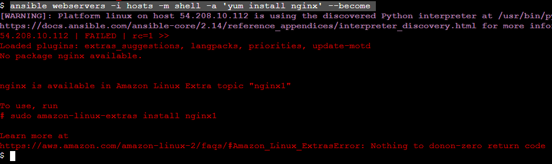

Configurando um servidor web em seus hosts
----------------------------------------------------


Para realizar este laboratório, você precisa ter realizado o a configuração do exercicio de [configuração de hosts](../../Appendix/Ansible/04-configure-hosts.md). A partir  de seu console você execuratá o comando de checagem de conectividade do `Ansible` para o seu parque de servidores.

Crie um diretório `posmack/labs/lab02` e nesse diretório crie um arquivo de `hosts` para este exercício e execute o comando: 

```console

ansible -i hosts all -m ping

```
Agora você precisa instalar e configurar um serviço HTTP em seus hosts utilizando esta sintaxe:

```css

ansible [pattern] -m [module] -a "[module options]"

```

Assim você terá que instalar o pacote `nginx` que é um serviço HTTP disponível para o Linux em todos os servidores:

```console

ansible webservers -i hosts -m shell -a 'yum install nginx' --become

```

>Observação
>Este é o comando básico para execução da instalação do pacote em servidoresem distribuições padrão, imagens da AWS podem apresentar a seguinte mensagem:

>_nginx is available in Amazon Linux Extra topic "nginx1"_



para que a instalação seja em imagens específicas, verifique o comando correto para o cenário específico, neste caso:

>amazon-linux-extras install nginx1

```css

ansible webservers -i hosts -m ansible.builtin.shell -a 'yum amazon-linux-extras install nginx1' --become

```

o pacote deverá ser instalado:


você poderá verificar através do comando:

```css

ansible webservers -i hosts -m package -a 'name=nginx state=present' --become

```

>o `nginx` está instalado, mas não necessariamente funcionando, você deverá checar se o security group de suas instâncias permite acesso pelas portas do HTTP e HTTPS (geralmente 80 e 443 respectivamente).

com o serviço instalado você precisará iniciá-lo:

```css

ansible webservers -i hosts -m service -a "name=nginx state=started enabled=yes" --become

```