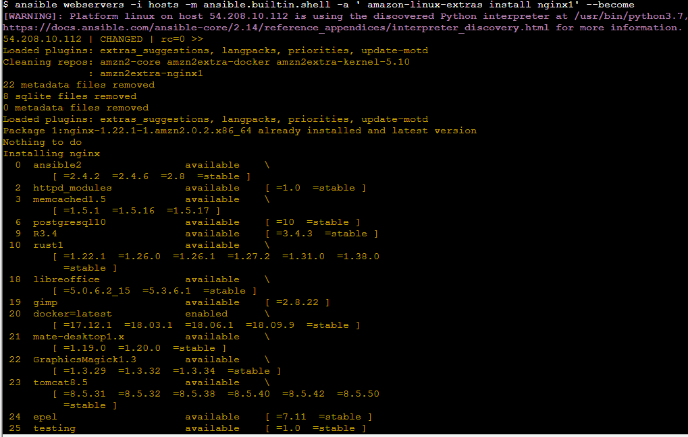
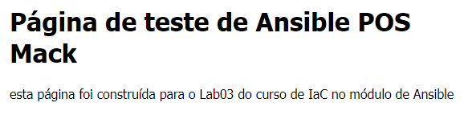

Alterar a página inicial de seus servidores
----------------------------------------------------

O `nginx` foi instalado e configurado no exercício anterior, e apresentava a tela padrão quando era acessado

Agora vamos alterar essa página para que fique personalizada, mais ou menos como essa:

Vamos lá?