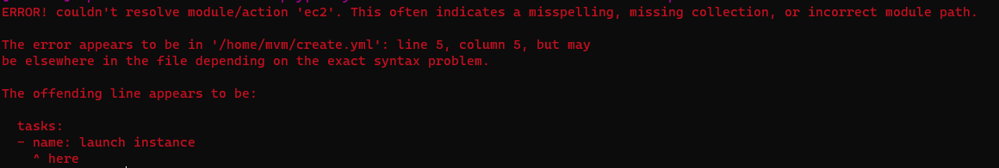
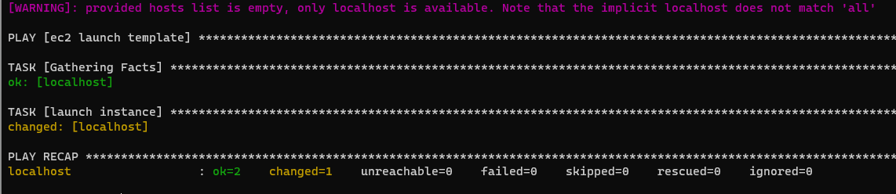

Criando uma instância EC2 (AWS) e serviço NGINX personalzado
==========================================================================================================================================

Para este exercício você deverá ter concluído a instalação de uma instância `EC2` explicada no apêndice de exemplos [Playbook Create Instance](../../Appendix/Ansible/02-create-instance.md) 


Pode ser que você tenha notado que o módulo utiizado no exercício foi o  `amazon.aws.ec2` que foi descontinuado a partir da versão 4.0.0, veja o `playbook` como estava:

```yaml

- name: ec2 launch template
  hosts: localhost
  connection: local
  tasks:
  - name: launch instance
    ec2:
      instance_type: t2.micro
      key_name: ansible
      image: ami-0b5eea76982371e91
      region: us-east-1
      count: 1
      vpc_subnet_id: subnet-7755d746
      wait: yes
      assign_public_ip: yes
      instance_tags:
        Name: ansible_instance

```

Sua instância pode ter sido criada e você pode ter notado um _Warning_ caso esteja com uma versão mais antiga da `collection`, para saber a versão que você possui instalada, verifique o comando:

```console

ansible-galaxy collection list | grep -i aws

```

Caso queira atualizar sua `collection` para a versão mais atual, execute o comando

```console

ansible-galaxy collection install amazon.aws

```
Entretanto, se você estiver com uma versão da `collection` superior a v4.0.0, e tentar executar o `playbook` proposto, verá que ele simplesmente não irá funcionar, 



então desafio é:

* Atualizar a versão da collection para a versão mais recente
* Alterar o `playbook` proposto para que ele passe a utilzar o novo módulo de criação de instâncias da `AWS` que é o `amazon.aws.ec2_instance`

>Algumas dicas são importantes, o módulo sofreu algumas alterações estruturais, portanto, uma simples alteração neste parâmetro de seu `yaml` não irá funcionar. Sendo assim, verifique a documentação disponível em [amazon.aws.ec2_instance](https://docs.ansible.com/ansible/latest/collections/amazon/aws/ec2_instance_module.html) ou utilize a própria documentação do `ansible` disponível em seu console:

```console

ansible-doc -s amazon.aws.ec2_instance

```

Depois de ter atualizado e o seu `playbook` teste-o para verificar se a instância é criada:


    ansible-playbook create.yml

Em caso de sucesso, você deverá observar o seguinte resultado:



Uma nova instância deve ter sido criada, sucesso!

Agora podemos configurar nosso _Webserver_ personalizado, lembra?


Claro que repetir os comandos dos exercícios [Ansible Intro-02-lab](../../03%20-%20Ansible%20Intro/labs/02-lab.md) e   [Ansible Intro-03-lab](../../03%20-%20Ansible%20Intro/labs/03-lab.md) vão te levar ao mesmo resultado, mas queremos transformar aqueles comando `ansible` adhoc em um novo playbook, pode chamá-lo de `install-web-server.yml`, vamos tentar?

Lembre-se que a sua nova instância ainda não possui a configuração de chaves assimétricas que utilizamos para nossos acessos, portanto, você terá que configurá-la antes de executar qualquer comando de configuração, além disso, precisaremos incluir seu endereço de IP público no nosso arquivo de `inventário`, lembra no nosso `hosts`

```css
[webservers]
10.0.0.1
```

Então é mão na massa, vamos construir o nosso playbook de configuração!