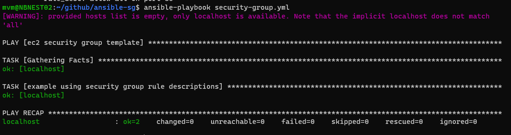

Criando um security group
==========================================================================================================================================

Nos exercícios anteriores provisionamos instâncias EC2 que possuiam um serviço `nginx` configurado com uma página personalizada, agora vamos tentar provisionar um outro recurso, um `security group`, você provavelmente já conhece este recurso, ma caso queira saber um pouco mais, pode acessar a documentação oficial [AWS Security Groups](https://docs.aws.amazon.com/pt_br/AWSEC2/latest/UserGuide/ec2-security-groups.html).

Como você já sabe o provisionamento de um recurso via `ansible` pode ser feita via `playbook` e precisamos conhecer o módulo que desejamos utilizar para esse provisionamento, no nosso caso, o `amazon.aws.ec2_security_group`

```yaml

- name: ec2 security group template
  hosts: localhost
  connection: local
  tasks:
  - name: example using security group rule descriptions
    amazon.aws.ec2_security_group:
      name: ansible-sg
      description: sg to ansible hosts
      vpc_id: vpc-6fxxxxx
      region: us-east-1
      rules:
        - proto: tcp
          ports:
          - 80
          cidr_ip: 0.0.0.0/0
          rule_desc: allow all on port 80

```

Este `security group` irá provisionar um novo grupo habilitando a porta 80 para o protocolo `tcp`, altere os valores de sua `region` e `vpc_id` e salve o arquivo `security-group.yml`, depois execute o comando:

```css

ansible-playbook security-group.yml

```

como resultado, você pode ter:



E na sua conta da `AWS` você terá o novo `security group` criado:


Parabéns, agora é só explorar outros módulos e descobrir como utilizá-los em conjunto para produzir `playbooks` complexos!