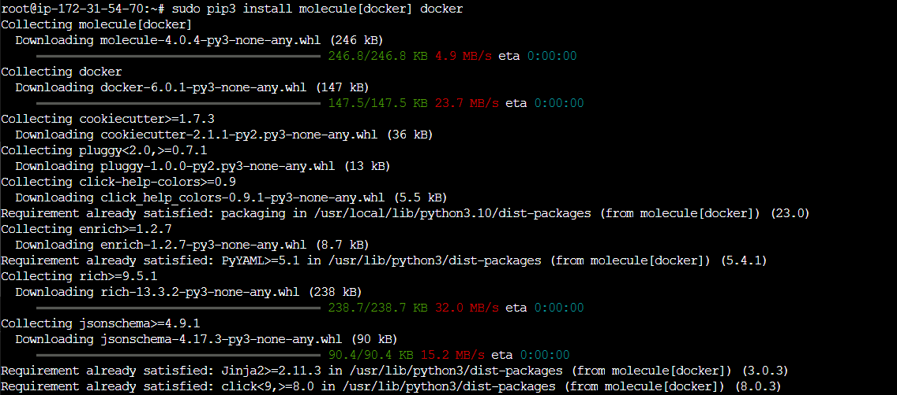
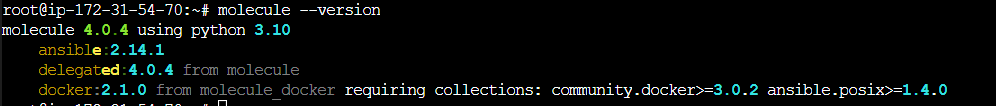
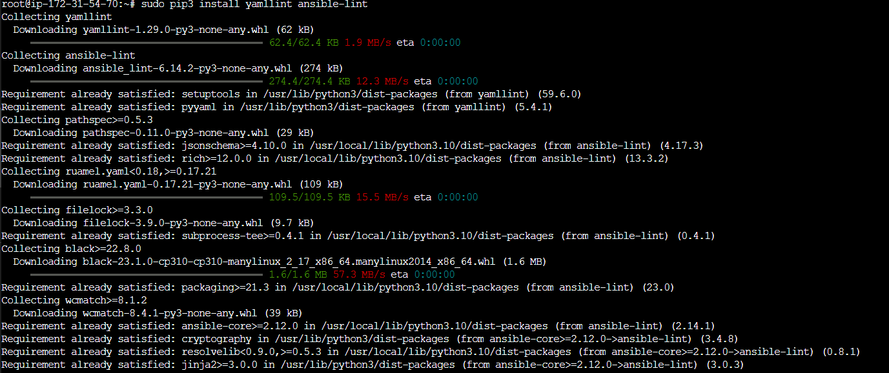

Ansible `Molecule`
=======================================================

O projeto `Molecule` foi criado para ajudar no desenvolvimento e testes em Ansible.

`Molecule` fornece suporte para testes com múltiplas instâncias, sistemas operacionais e distribuições, fornecedores de virtualização, estruturas de teste e cenários de teste.

`Molecule` incentiva uma abordagem que resulta em papéis consistentemente desenvolvidos que são bem escritos, facilmente compreendidos e mantidos.

`Molecule` suporta apenas as duas últimas versões principais do Ansible (N/N-1), o que significa que se a última versão for 2.9.x, também testaremos nosso código com 2.8.x.

Instalando o Ansible Molecule
---------------------------------------------------

Existem várias formas de habilitar os pacotes necessários para utilizarmos o `Molecule` e a sequência de comandos dependerá do tipo da sua distribuiçao `linux` e da abrangência e propósito de testes que você quer implementar, para o nosso escopo, a proposta é instalarmos os pacotes no nosso console `Ansible` que já possui alguns dos pacotes que iremos utilizar habilitados.

O primeiro passo é instalar o pacote do `Molecule`, mas vamos adicionar uma extenção de suporte para o docker, como já temos o `python` instalado em nosso console, utilizaremos o `pip` (ou `pip3` dependendo da versão):

```css

pip3 install molecule[docker] docker

```
Observe que alguns dos pacotes já estarão presentes em seu console



Verifique os pacotes instalados para o `molecule`

```css

molecule --version

```



agora vamos completar nossa instalação com os pacotes de _linting_ do `ansible` como o `Ansible Lint`que é uma ferramenta de linha de comando para a formatação de _playbooks_, _roles_ e _collections_. Seu principal objetivo é promover práticas, padrões e comportamentos comprovados enquanto evita armadilhas comuns que podem facilmente levar a bugs ou tornar o código mais difícil de manter.

```css

molecule --version

```

Sua instalação apresentará os novos pacotes sendo instalados, como ocorreu com a instalação do `molecule`, alguns deles já estavam disponíveis previamente:



A partir deste ponto, já podemos utilizar o `molecule` para testar nossos playbooks.

Vamos utilizar o [lab](labs/01-lab.md) para este exercício: