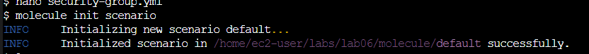
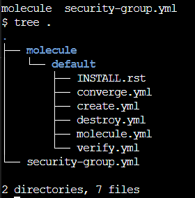
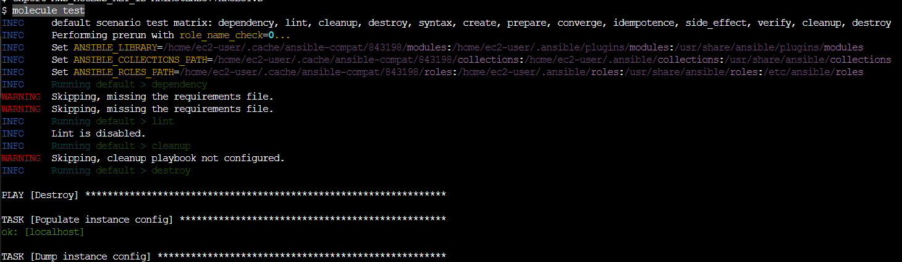

Criando testes com Molecule
========================================

Com o `Molecule` [instalado](../02-Molecule.md) em seu console `ansible`, crie uma pasta para este exercício, no meu console este é o lab06

```css

mkdir lab/lab06
cd lab/lab06

```

crie um arquivo de `playbook` que cria um `security group`, chamaremos de `security-group.yml`

```yaml
- name: ec2 security group template
  hosts: localhost
  connection: local
  tasks:
  - name: example using security group rule descriptions
    amazon.aws.ec2_security_group:
      name: ansible-sg
      description: sg to ansible hosts
      vpc_id: vpc-6f139812
      region: us-east-1
      rules:
        - proto: tcp
          ports:
          - 80
          cidr_ip: 0.0.0.0/0
          rule_desc: allow all on port 80
```

no mesmo diretório execute o comando para iniciar o `molecule`

```css

molecule init scenario

```
O `molecule` criará a estrutura básica para sua execução:



Verifique a estrutura criada pelo `molecule`



* O `create.yml` é um arquivo de playbook usado para criar as instâncias e armazenar dados no `instance-config`.
* O `destroy.yml` contém o código do Ansible para destruir as instâncias e removê-las do `instance-config`.
* O `molecule.yml` é o ponto de entrada central de configuração do Molecule por cenário. Com esse arquivo, você pode configurar cada ferramenta que o Molecule empregará ao testar sua função.
* O `converge.yml` é o arquivo de playbook que contém a chamada para sua função. O Molecule invocará esse playbook com o `ansible-playbook` e o executará em uma instância criada pelo driver.


*** Analisando o arquivo molecule.yml

O `molecule.yml` serve para configurar o Molecule. É um arquivo [YAML](https://yaml.org/) com chaves que representam os componentes de alto nível que o Molecule fornece. Esses são:

**The** [**dependency**](https://ansible.readthedocs.io/projects/molecule/configuration/#dependency) **manager:** O Molecule usa o [galaxy development guide](https://docs.ansible.com/ansible/latest/galaxy/dev_guide.html) por padrão para resolver suas dependências de função.
**The** [**platforms**](https://ansible.readthedocs.io/projects/molecule/configuration/#platforms) **definitions:** O Molecule se baseia nisso para saber quais instâncias criar e nomear e a qual grupo cada instância pertence. Se você precisar testar sua função em várias distribuições populares ([CentOS](https://developers.redhat.com/products/rhel/centos-and-rhel), Fedora, Debian, [Red Hat Enterprise Linux](https://developers.redhat.com/products/rhel/overview)), poderá especificar isso nesta seção.
* O [**provisionador**](https://ansible.readthedocs.io/projects/molecule/configuration/#provisioner)**:** O Molecule fornece apenas um provisionador Ansible. O Ansible gerencia o ciclo de vida da instância com base nessa configuração.
* O [**cenario**](https://ansible.readthedocs.io/projects/molecule/configuration/#scenario) *: O Molecule depende dessa configuração para controlar a ordem da sequência do cenário.
* **The** [**verifier**](https://ansible.readthedocs.io/projects/molecule/configuration/#verifier) **framework:** O Molecule usa o Ansible por padrão para fornecer uma maneira de escrever testes específicos de verificação de estado (como _smoke tests_ de implementação) na instância de destino.


Altere a estrutura do seu arquivo molecule/default/converge.yml para adequar-se ao nosso cenário

```yaml
- name: Converge
  hosts: all
  gather_facts: false
  tasks:
    - ansible.builtin.debug:
        msg: "Fake ansible.builtin.import_playbook : ../../security-group.yml"

- name: Include a play after another play
  ansible.builtin.import_playbook: ../../security-group.yml
  ```

  Verifique se suas credenciais estão ok em seu console

```console
aws_access_key_id = xxxxxxxxxxxxxxxx
aws_secret_access_key = xxxxxxxxxxxxxxxxxxxxxxxxxxxxxxxxxxxxxxx
```

os comandos para configura suas variáveis de acesso você já conhece:

```css
export AWS_ACCESS_KEY_ID=<ACCESS_KEY_ID>
export AWS_SECRET_ACCESS_KEY=<SECRET_ACCESS_KEY>
```

Podemos realizar o teste do `molecule` utilizando o comando:

```css
molecule test
```
Como resultado você verá a execução dos testes do molecule



Muito bom! Temos testes configurados para nosso `playbook`