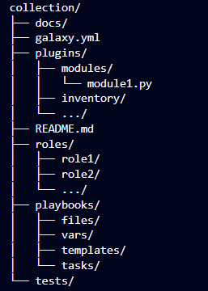

Ansible Galaxy
=======================================================

Ansible Galaxy é essencialmente um grande repositório público de `collections` para `Ansible`. As `collections` possuem `roles` que são enviados com [READMEs](../Appendix/Ansible/extras/nginx-role-README.md) que detalham o uso da `collection` e as variáveis disponíveis. O Galaxy contém um grande número de funções que estão em constante evolução. O Galaxy pode usar o GitHub para adicionar outras fontes de funções, como o GitHub

O Ansible Galaxy refere-se ao website [Galaxy](https://galaxy.ansible.com/), um site gratuito para encontrar, baixar e compartilhar `collections` desenvolvidos pela comunidade.

Use o Galaxy para iniciar seu projeto de automação com grande conteúdo da comunidade do Ansible Galaxy. O Galaxy fornece unidades de trabalho pré-construídas. Você pode encontrar funções para infra-estrutura de provisionamento, implantação de aplicações e todas as tarefas que você faz diariamente. O formato de coleta fornece um pacote abrangente de automação que pode incluir vários `playbooks`, `roles`, `modules` e `plugins`.

Estrutura de uma collection
-------------------------------------------------------

Ansible `collections` podem incluir qualquer tipo de `plugin` disponível dentro do Ansible Core, inclundo `roles`, `playbooks`, etc. Abaixo está um exemplo de estrutura de uma `collections`

Como você pode ver, os `playbooks` e `roles` podem ser incluídos na coleção, assim como outros `plugins`. Todos estes estão disponíveis através do método de `namespacing` . O uso de `namespaces` pela Ansible Collections ajuda a evitar colisões de plugins, módulos, etc., bem como ter cada coleção disponível por seu nome de coleção totalmente qualificado (FQCN). Podemos explorar este conceito na própria [documentação](https://galaxy.ansible.com/docs/contributing/namespaces.html) do `ansible`.

Ao longo do curso já exploramos alguns conceitos que fazem parte de uma `collection` como `playbooks` e `modules`, agora vamos explorar mais alguns.

**roles**
--------------------------------------------
Ansible `roles`são um método de organização de certas variáveis, tarefas, arquivos, modelos e manipuladores(`handlers`) com base em uma estrutura de arquivos conhecida. O agrupamento de conteúdo por funções permite o fácil compartilhamento e reutilização. A documentação `ansible` sobre funções define a estrutura de diretórios e arquivos.

Desta forma, uma `role` pode conter um conjunto de instruções estruturadas que devem ser realizadas para executar uma tarefa complexa, uma vez que a `role` foi devidamente codificada, o trabalho do desenvolvedor torna-se extremamente simples.

Vamos explorar um pouco desse recurso no  [lab 01](labs/01-lab.md) deste tópico.

**plug-ins**
--------------------------------------------

Os plugins são peças de código que aumentam a funcionalidade central do Ansible. Ansible usa uma arquitetura de plugins para permitir um conjunto de recursos rico, flexível e expansível. O Ansible é fornecido com vários plugins, e você pode facilmente escrever o seu próprio plugin.

**Qual é a diferença entre um módulo e um plugin?**

Os plugins oferecem opções e extensões para as principais características do Ansible: transformação de dados, registro de saída, conexão ao inventário, e muito mais. Os módulos são um tipo de plugin que executam tarefas de automação em um `host` (geralmente um sistema remoto).

**Benefícios do Galaxy**
--------------------------------------------------
Como o Galaxy possui um vasto conjunto de soluções, você pode utilizar e contribuir com o repositório, tornando o dia-a-dia do administrador mais produtivo, saiba mais explorando a [documentação](https://docs.ansible.com/ansible/latest/galaxy/user_guide.html) de utilização do Galaxy.