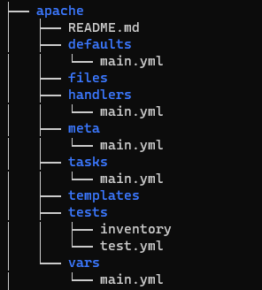
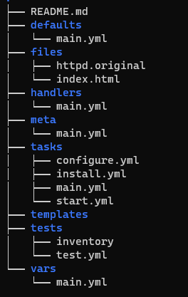
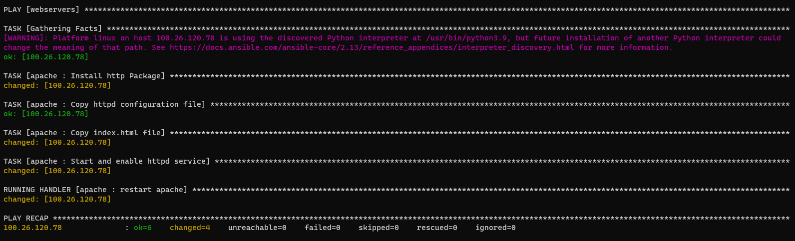

Criando uma role com ansible-galaxy
============================================

Vamos criar uma `role` usando o comando `ansible-galaxy`, nesse lab vamos utilizar a estrutura inicial fornecida pelo parâmetro `init`, fazer algumas modificações para chegarmos a um resultado que explique toda a estrutura da nova `role`

A primeira coisa que você deve fazer é acessar o diretório para configurar as suas `roles`,  esse diretório é  `/etc/ansible/roles`.

```css

cd /etc/ansible/roles

```

Em seguida vamos criar a estrutura para iniciarmos a codificação de nossa `role` utilizando o o commando `ansibe-galaxy` com o parâmetro `init`

```css

ansible-galaxy init ./apache --offline

```

O Segundo parâmetro `./apache` indica o diretório a ser criado com a estrutura da `role` e o terceiro parâmetro `--offline` indica que não queremos que essa `role` seja sincronizada com o site do [Ansibe-Galaxy](https://galaxy.ansible.com/).


Após a execuçao do comando a estrutura deve estar criada:



Vamos explicar a estrutura de diretórios criada pelo comando:

  * **defaults**: Este diretório é criado para conter as variáveis padrão de sua `role`
  * **files**: Este diretório é criado para que os arquivos externos que serão utilizados pela sua `role` possam ser gravados, por exemplo, um arquivo como o `index.html`
  * **handlers**: Este diretório é criado para o armazenamento de `handlers` . Os `handlers` são tarefas que podem ser marcadas durante um `play` para serem executadas na conclusão da peça.
  * **meta**: Este diretório é criado para armazenar as informações gerais a respeito da `role` como por exemplo as plataformas suportadas pela `role`
  * **task**: Este diretório irá armazenar as tarefas que sua `role` deverá executar, como as atualizações de pacotes, instalações, configurações ou cópias de arquivos, por exemplo
  * **templates**: Este diretório poderá armazenar arquivos de `template` que serão utilizados pela `role` geralmente os arquivos são do tipo `.tpl` e são normalmente utilizados para configurar serviços baseados em valores variáveis que podem ser configurados no próprio playbook, em arquivos variáveis incluídos, ou obtidos através dos `facts`.
  * **tests**: Como o próprio nome indica, o diretório é criado com a estrutura básica de execução de testes
  * **vars**: Este diretório armazenará as variáveis de execução da `role`, como já temos um diretório `default` que contém variáveis padrão, tudo que for informado no diretório `vars` sobrescreverá o conteúdo do diretório `default`

Agora vamos entender como configurar cada parte de nossa `role` partindo de uma informação já conhecida, um `playbook`:

```yaml
---
- hosts: all
  tasks:
  - name: Install http Package
    yum: name=httpd state=latest

  - name: Copy httpd configuration file
    copy: src=/data/httpd.original dest=/etc/httpd/conf/httpd.conf

  - name: Copy index.html file
    copy: src=/data/index.html dest=/var/www/html/index.html
    notify:
    - restart apache

  - name: Start and enable httpd service
    service: name=httpd state=restarted enabled=yes

  handlers:
  - name: restart apache
    service: name=httpd state=restarted
```
Este é um playbook simples que instala o pacote para o Apache, altera alguns arquivos e inicia o serviço vinculando a uma checagem.

Agora vamos iniciar nossa confguração para que esta mesma tarefa seja feita pela nossa `role`

Primeiro você deve preparar os arquivos que farão parte de sua `role`, baseado no que vemos no `playbook` acima, nossa `role`necessitará de um arquivo `httpd.original` e um arquivo `index.html` grave os dois arquivos na pasta `file` dentro do diretório criado pelo `init`, no nosso caso, o diretório `apache`

>Dica: você pode verificar o conteúdo do arquivo `httpd.original` em vários repositórios disopníveis na `web`como no repositório da [apache.org](https://svn.apache.org/repos/infra/websites/cms/webgui/conf/httpd.conf), mas recomendamos que você utilize o padrão da [AWS](../../Appendix/Ansible/extras/httpd.conf) ou para [Ubuntu](../../Appendix/Ansible/extras/apache2.conf).

O conteúdo do arquivo `index.html` pode ser o mesmo utlizado em exercícios anteriores como [este](../../04%20-%20Ansible-Playbook/labs/01-lab.md).

Agora vamos configurar as nossas `tasks`. Uma forma de organizar as tarefas é identificando como podemos agrupa-las, um exemplo que podemos usar a partir do `playbook` acima é a separação das tarefas em 3 tipos: **instalação**, **configuração** e **inicialização**. 

Vamos criar 3 arquivos distintos no nosso diretório `task`.

**task/install.yml**

```yaml
---
- name: Install http Package
  yum: name=httpd state=latest
```
ou para Ubuntu


```yaml
---
- name: Install http Package
  package:
    name: apache2
    state: present
```


**task/configure.yml**

```yaml
---
- name: Copy httpd configuration file
  copy: src=files/httpd.original dest=/etc/httpd/conf/httpd.conf
- name: Copy index.html file
  copy: src=files/index.html dest=/var/www/html/index.html
  notify:
  - restart apache
```

ou para Ubuntu

```yaml
---
- name: Copy httpd configuration file
  copy: src=files/httpd.original dest=/etc/apache2/apache2.conf
- name: Copy index.html file
  copy: src=files/index.html dest=/var/www/html/index.html
  notify:
  - restart apache
```

**task/start.yml**

```yaml
---
- name: Start and enable httpd service
  service: name=httpd state=restarted enabled=yes
```

ou para Ubuntu

```yaml
---
- name: Start and enable httpd service
  service: name=apache2 state=restarted enabled=yes
```


Com nossos 3 arquivos de tarefas criados, vamos configurar o nosso `tasks/main.yml` importanto todas as tarefas na ordem que elas precisam ser executadas:

**tasks/main.yml**

```yaml
---
# tasks file for ./apache

- import_tasks: install.yml
- import_tasks: configure.yml
- import_tasks: start.yml
```

>**Importante**: Reparem que no arquivo de configuração, já alteramos o caminho de origem dos arquivos para o diretório `files`

Após esta etapa, precisamos configurar o `handler` que é descrito na cláusula `notify` dos arquivo de `tasks/configure.yml`

**handlers/main.yml**
```yaml
---
# handlers file for ./apache
- name: restart apache
  service: name=httpd state=restarted
```
ou para Ubuntu

```yaml
---
# handlers file for ./apache
- name: restart apache
  service: name=apache2 state=restarted
```

Agora você pde dar uma olhada nos seu arquivo `meta/main.yml` e alterar alguns dados, como o autor a descrição, etc. Veja que existem outras informações no arquivo que podem ser úteis no caso de termos que publicar essa `role` como a licença, as plataformas suportadas entre outras informações.

Com estas alterações nossa `role` deve estar assim:



Agora você já pode gerar um `playbook` simples que irá executar a sua `role`:

**apache_role.yml**
```yaml
---
- hosts: webservers
  roles:
  - apache
```

Crie o seu arquivo de `hosts` para configurar os servidores que receberão sua `role` e execute o `playbook` como `root`.

```css
ansible-playbook -i hosts apache_role.yml --become
```

Sua `role` será executada através do `playbook` que você acabou de configurar:



Agora é estudar as outras opções de configuração de `roles` e avançar nos conhecimentos de provisionamento de infra-estrutura do `ansible`.