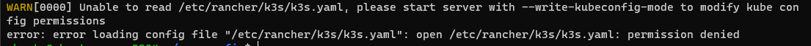
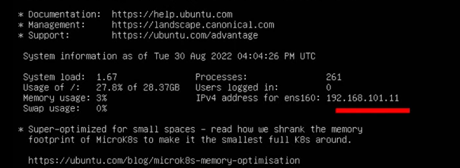
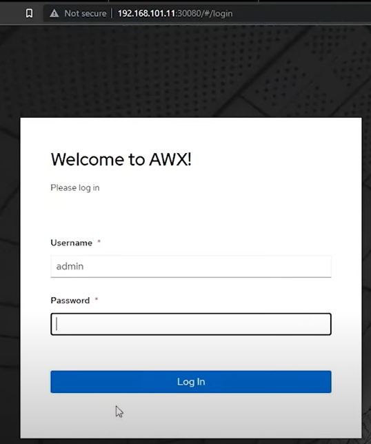
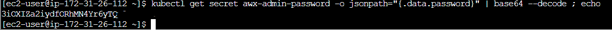

Instalando o AWX
=======================================

A primeira tarefa a ser feita é a instalação e configuração de um _cluster_. Vou sugerir que seja utilizado o [k3s](https://docs.k3s.io/quick-start) que é mais leve e baseado no Kubernetes.

Seguindo a documentação, você executará o comando:

```css
curl -sfL https://get.k3s.io | sh -
```

Este comando trará a instalação mais adequada a sua distribuição, mas não deixará totalmente pronta para ser executada por usuário sem elevação de privilégio, confira:

```css
kubectl version
```

Repare que usuários sem elevação de privilégio não tem acesso aos arquivos de configuração do `k3s`:



Para evitar o desconforto de sempre utilizarmos o `sudo` antes de cada comando para o cluster, vamos alterar a proriedade do arquivo `/etc/rancher/k3s/k3s.yaml`, levando em conta o usuário e grupo que você está logado no terminal, neste caso o usuário (que pode ser obtido pelo comando `whoami`) e o grupo (que pode ser obtido pelo comando `groups`) são `ubuntu:ubuntu`.

```css
sudo chown ubuntu:ubuntu /etc/rancher/k3s/k3s.yaml
```

Ao executar novamente o `kubectl version` você deve obter sucesso e pode operar seu cluster sem a necessidade de eleveçao de privilégios a cada execução:

```css
WARNING: This version information is deprecated and will be replaced with the output from kubectl version --short.  Use --output=yaml|json to get the full version.
Client Version: version.Info{Major:"1", Minor:"25", GitVersion:"v1.25.7+k3s1", GitCommit:"f7c20e237d0ad0eae83c1ce60d490da70dbddc0e", GitTreeState:"clean", BuildDate:"2023-03-10T22:16:07Z", GoVersion:"go1.19.6", Compiler:"gc", Platform:"linux/amd64"}
Kustomize Version: v4.5.7
Server Version: version.Info{Major:"1", Minor:"25", GitVersion:"v1.25.7+k3s1", GitCommit:"f7c20e237d0ad0eae83c1ce60d490da70dbddc0e", GitTreeState:"clean", BuildDate:"2023-03-10T22:16:07Z", GoVersion:"go1.19.6", Compiler:"gc", Platform:"linux/amd64"}
```
Com seu acesso assegurado, pode tentar executar alguns comandos para verificar a saúde de seu _cluster_

```css
kubectl get nodes

```
```css
NAME               STATUS   ROLES                  AGE     VERSION
ubuntuserver2204   Ready    control-plane,master   3h54m   v1.25.7+k3s1
```


```css
kubectl get namespaces
```

```
NAME              STATUS   AGE
default           Active   3h59m
kube-system       Active   3h59m
kube-public       Active   3h59m
kube-node-lease   Active   3h59m
```


### Instalação básica do AWX

Uma vez que você tenha um cluster Kubernetes em funcionamento, você pode implantar o AWX Operator em seu cluster usando [Kustomize](https://kubectl.docs.kubernetes.io/guides/introduction/kustomize/). Siga as instruções aqui para instalar a última versão do Kustomize: https://kubectl.docs.kubernetes.io/installation/kustomize/, como no nosso caso, nossa distribuição é um `ubuntu` server, vamos seguir os seguintes passos:

* Crie um diretório temporário, pode ser chamado `km-install`, depois acesse:

```css
mkdir km-instal
cd km-install
```

Agora execute a instalação do `kustomize`:

```css
curl -s "https://raw.githubusercontent.com/kubernetes-sigs/kustomize/master/hack/install_kustomize.sh" | bash 
```
>DICA: em alguns cenários sua instância pode apresentar falhas de certificado, para resolver este problema de forma rápida, acrescente a instrução ` --insecure` logo após a URL

verifique se a instalação ocorreu com sucesso dando uma olhada no conteúdo da pasta atual :

Se a instalação ocorreu com sucesso, recomendo que você mova para um diretório que democratize o `kustomize`:

```css
sudo mv kustomize /usr/local/bin
```

certifique-se de que essa movimentação ocorreu com sucesso:

```css
which kustomize
```

Agora vamos para a configuração, vamos criar um arquivo chamado `kustomization.yaml` com o seguinte conteúdo:

```yaml
apiVersion: kustomize.config.k8s.io/v1beta1
kind: Kustomization
  # Find the latest tag here: https://github.com/ansible/awx-operator/releases
resources:
  - github.com/ansible/awx-operator/config/default?ref=<tag>

# Set the image tags to match the git version from above
images:
  - name: quay.io/ansible/awx-operator
    newTag: <tag>

# Specify a custom namespace in which to install AWX
namespace: awx
```
>Atenção: você deve substituir a `<tag>` por uma versão válida do repositório, existe um comentário no próprio arquivo orientando a consultar a versão no [github]( https://github.com/ansible/awx-operator/releases)

Para nossa instalação, substituímos a `<tag>` pela versão `1.3.0`.

> **DICA:** Se você precisar alterar alguma das configurações padrão para o operador (como recursos.limites), você pode adicionar [patches](https://kubectl.docs.kubernetes.io/references/kustomize/kustomization/patches/) na parte inferior de seu arquivo kustomization.yaml.

agora execute a primeira construção com o comando `build` e `apply`:

```css
$ kustomize build . | kubectl apply -f -
```

este deverá ser o resultado:

```
namespace/awx created
customresourcedefinition.apiextensions.k8s.io/awxbackups.awx.ansible.com created
customresourcedefinition.apiextensions.k8s.io/awxrestores.awx.ansible.com created
customresourcedefinition.apiextensions.k8s.io/awxs.awx.ansible.com created
serviceaccount/awx-operator-controller-manager created
role.rbac.authorization.k8s.io/awx-operator-awx-manager-role created
role.rbac.authorization.k8s.io/awx-operator-leader-election-role created
clusterrole.rbac.authorization.k8s.io/awx-operator-metrics-reader created
clusterrole.rbac.authorization.k8s.io/awx-operator-proxy-role created
rolebinding.rbac.authorization.k8s.io/awx-operator-awx-manager-rolebinding created
rolebinding.rbac.authorization.k8s.io/awx-operator-leader-election-rolebinding created
clusterrolebinding.rbac.authorization.k8s.io/awx-operator-proxy-rolebinding created
configmap/awx-operator-awx-manager-config created
service/awx-operator-controller-manager-metrics-service created
deployment.apps/awx-operator-controller-manager created
```

Espere um pouco e você deve ter o `awx-operador` funcionando:

```
$ kubectl get pods -n awx
```

O Resultado deve ser semelhante a:

```
NAME                                               READY   STATUS    RESTARTS   AGE
awx-operator-controller-manager-66ccd8f997-rhd4z   2/2     Running   0          11s
```

Vamos evitar a repetição do comando `-n awx'` configurando o contexto:

```
$ sudo kubectl config set-context --current --namespace=awx
```

Em seguida, crie um arquivo chamado `awx.yaml` na mesma pasta com o conteúdo sugerido abaixo. O `metadata.name` que você fornecer será o nome da implantação AWX resultante.

**Nota:** Se você implantar mais de uma instância AWX no mesmo espaço de nomes, certifique-se de utilizar nomes únicos.

```yaml
---
apiVersion: awx.ansible.com/v1beta1
kind: AWX
metadata:
  name: awx
spec:
  service_type: nodeport
  nodeport_port: 30080
```

> Pode fazer sentido criar e especificar sua própria `secret` para implantação, de modo que, se o segredo k8s for apagado, ele possa ser recriado, se necessário.  Se não for fornecida, uma será gerada automaticamente, mas não poderá ser recuperada se perdida. Leia mais [aqui](https://github.com/ansible/awx-operator#secret-key-configuration).


Se você estiver em Openshift, você pode aproveitar as Rotas especificando os seguintes parâmetros. Isto criará automaticamente uma Rota para você com um nome de hostname personalizado. Isto pode ser encontrado na seção Rota do Openshift Console.

```yaml
---
apiVersion: awx.ansible.com/v1beta1
kind: AWX
metadata:
  name: awx
spec:
  service_type: clusterip
  ingress_type: Route
```


Certifique-se de adicionar este novo arquivo à lista de "recursos" em seu arquivo `kustomization.yaml`:

```yaml
...
... recursos:
  - github.com/ansible/awx-operator/config/default?ref=<tag>
  # Adicione esta linha extra:
  - awx.yaml
...
```

Finalmente, execute `kustomize` novamente para criar a instância AWX em seu _cluster_:

```
kustomize build . | kubectl apply -f -
```

Isso deve levar alguns minutos para ser totalmente concluído, caso queira, voce pode acompanhar a evolução da construção do seu _deployment_ abrindo um novo terminal e executando o comando:

```css
kubectl logs -f deployments/awx-operator-controller-manager -c awx-manager --since 10s
```
Sua instalação terá ocorrido com sucesso quando você localizar a mensagem:

```
PLAY RECAP *********************************************************************
localhost                  : ok=78   changed=0    unreachable=0    failed=0    skipped=80   rescued=0    ignored=1
```

Ao final do _build_ confira o resultado observando os _pods_ criados:

```
kubectl get pods
```

Seu _deployment_ deve conter os 3 pods :

```
NAME                                               READY   STATUS            RESTARTS   AGE
awx-operator-controller-manager-68d6f576b4-548nw   2/2     Running           0          33m
awx-postgres-13-0                                  1/1     Running           0          18m
awx-5b79ffdcbb-dq44r                               4/4     Running           0          14m
```

Agora é a parte final, você vai acessar o seu console AWX, para isso você deverá ter o endereço IP de sua instância:



E acessar sua instância pelo browser utilizando o IP e a porta que foi configurada no arquivo `awx.yaml`:



para resgatar a senha de sua instalação, acesse as chaves do seu cluster. Por padrão, o usuário administrador é `admin` e a senha está disponível no segredo `<resourcename>-admin-password`. Para recuperar a senha de administrador, execute:

```css
kubectl get secret awx-admin-password -o jsonpath="{.data.password}" | base64 --decode ; echo yDL2Cx5Za94g9MvBP6B73nzVLlmfgPjR
```


Você acabou de completar a instalação mais básica de uma instância AWX através deste operador. Parabéns!!!

