Dicas de Configuração
===========================================

Configurando Credenciais
-----------------------------

Credenciais AWX são usadas para autenticação ao lançar ou executar trabalhos em  servidores gerenciados, sincronizando com fontes de inventário e projetos de importação.

Por padrão, o Ansible AWX suporta muitas credenciais, incluindo a máquina VM através de autenticação SSH, Amazon Web Services, Google Compute Engine, OpenStack, Vault, Source Control, etc.

Para configurar as credenciais, clique no menu `Credentials` à esquerda e clique no botão `add` no lado direito do mesmo.

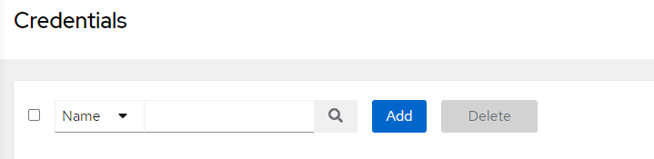

Agora digite as credenciais `NAME` e `DESCRIPTION`, depois especifique o 'TIPO CREDENCIAL' para `Machine`.

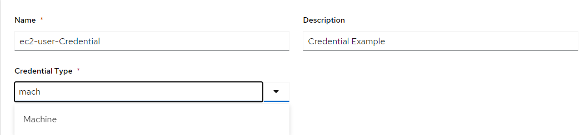

Simplesmente, a credencial `Machine` permitirá que você use a autenticação SSH para gerenciar servidores. Seu suporte tanto para autenticação por senha quanto por chave.

Para este guia, estaremos usando a autenticação baseada em chaves. Portanto, digite o nome de usuário e cole as chaves privadas para esse usuário.

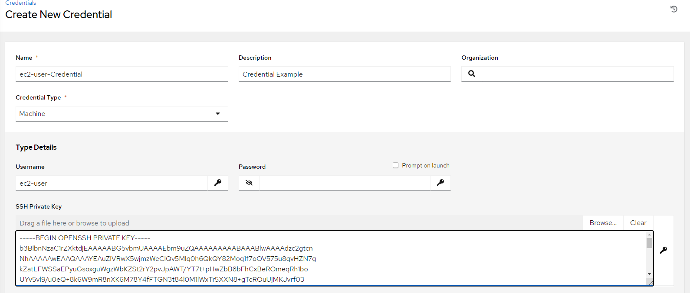

Salve a sua credencial!

No nosso cenário trabalhamos com a `AWS` para nossos estudos, portanto você precisará criar uma nova credencial do tipo `Amazon Web Services`

Inventários
------------------------------------------------

Os inventários são grupos de servidores `hosts` que são gerenciados pela Ansible AWX. Os inventários permitem a criação de um grupo com vários servidores host nele. E facilita a gestão de diferentes servidores com ambientes diferentes.

Para gerenciar e fornecer servidores, devemos criar um novo grupo de inventário e depois adicionar hosts de servidores a esse grupo de inventário.

Para adicionar um novo inventário, clique no menu 'Inventários' à esquerda, depois clique no botão `add` e escolha o 'Inventário'.

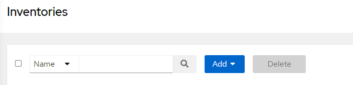

Preencha os campos e salve o inventário.

Depois acesse o seu inventário e vá até a aba `Source` depois clique em `add`

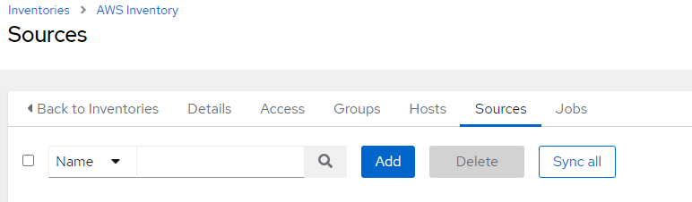

Vamos importar o nosso inventário a partir de nossas instâncias da `AWS`, para isso, selecione o tipo se seu `source` como `Amazon EC2`

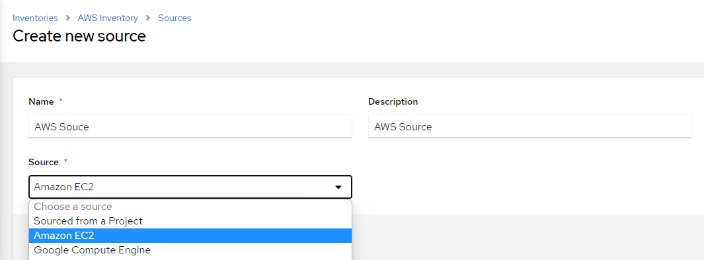

Selecione a sua Credencial do tipo `Amazon Web Services` cadastrada anteriormente e salve seu `source`.

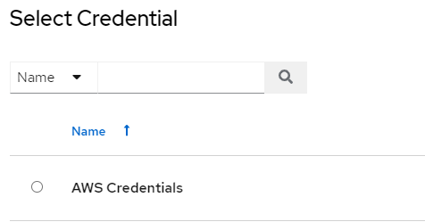

A partir daqui você já pode tentar atualizar o seu inventário, acessando a sua lista de `sources` dentro de seu inventário e clicando no ícone para sincronizar

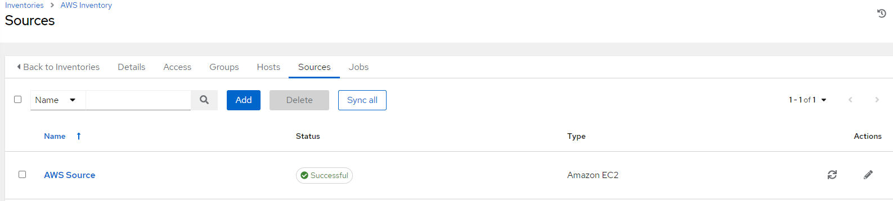

Caso queira, você pode acompanhar a execução na sua lista de `jobs`

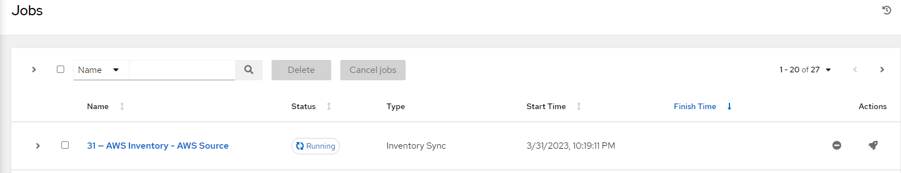

Se tudo estiver configurado corretamente você terá como resultado da execução um log parecido com este:

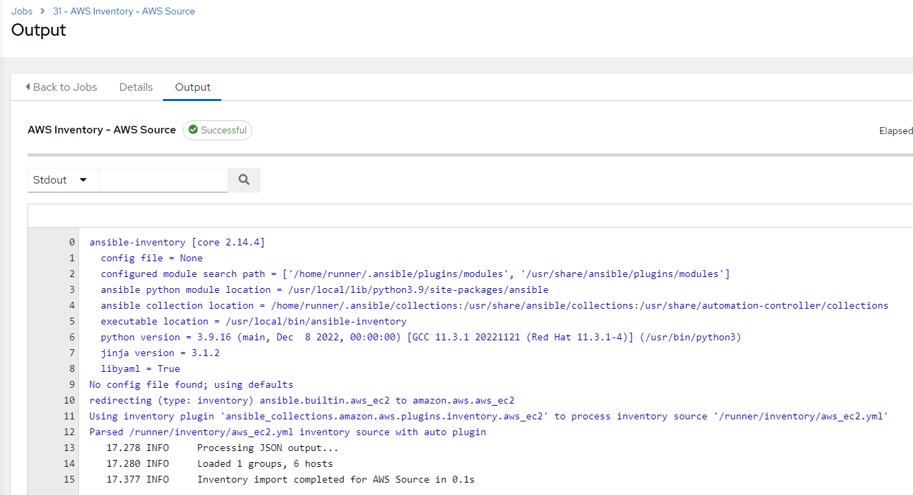

E sua lista de `hosts` em seu `inventory` estará atualizada.

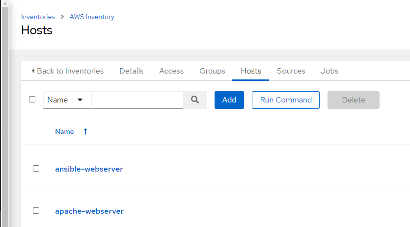
