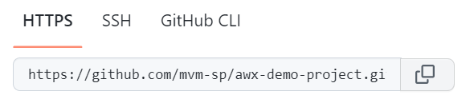
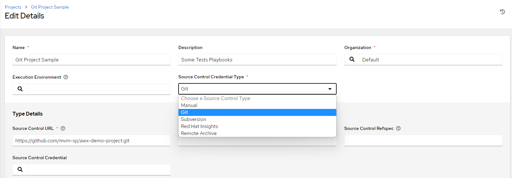
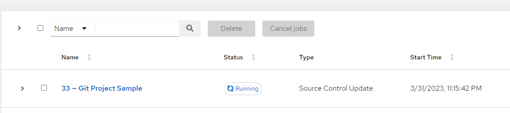
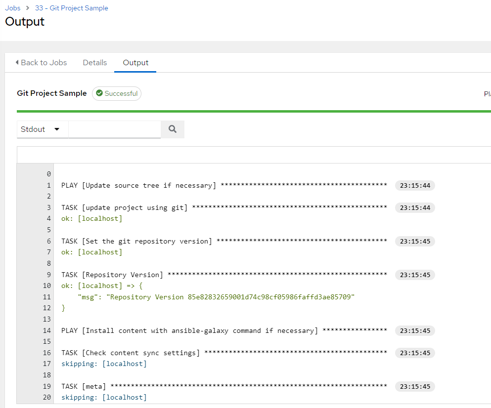

Criando um projeto no Ansible AWX
=======================================

Agora vamos criar um projeto no Ansible AWX, Os projetos são representados como `Playbooks Ansible` no AWX. São suas `Playbooks collections`  que podemos gerenciar através do diretório local de projetos ou usando algum sistema `Source Control Model`como Git, Subversion, Mercurial, e RedHat Insights.

O Primeiro passo é criar um repositório de `playbooks`, vamos utilizar o `GitHub`.

Crie um novo projeto e acrescente na raiz deste projeto o arquivo `ping.yml`.

```yaml
- hosts:
    - all
  tasks:
    - name: Example from an Ansible Playbook
      ansible.builtin.ping:
```

Agora copie a URL de seu projeto:



Retorne até o `Ansible AWX` e vá até o menu `Projects`, clique no botão `add`



Faça a configuração de seu projeto com os dados que o identifiquem, selecione `Source Control Credential Type`do tipo `Git` e cole sua `URL` copiada no campo `Source Control URL` como na imagem acima.

>ATENÇÃO: Repare que o campo `Source Control Credential` não está preenchido, isso porque o nosso repositório é público. Caso você trabalhe com repositórios privados, será necessária a criação de uma credencal para acessá-o.

Após salvar suas configurações você poderá solicitar que o Ansible AWX sincronize as informações a partir de seu repositório, basta clicar no ícone para sincronizar:


Você pode acompanhar a execução na sua lista de `jobs`



Após a execução, confira o resultado clicando para ver os  detalhes do `job`



Seu repositório foi criado com sucesso, agora vamos utilizar esse projeto para configurar um `Job Template`
