Configurando WorkFlows no Ansible AWX
==========================================

`Workflows`permitem configurar uma seqüência de `Job Templates`(ou modelos de `workflow`) díspares que podem ou não compartilhar inventário, `playbooks` ou permissões. Entretanto, os fluxos de trabalho têm permissões de 'administração' e 'execução', semelhantes aos modelos de trabalho. Um `workflow` realiza a tarefa de rastrear o conjunto completo de trabalhos que fizeram parte do processo de liberação como uma única unidade.

Os `Job Templates` ou `workflow` são ligados entre si usando uma estrutura tipo gráfico chamada nós. Estes nós podem ser trabalhos, sincronia de projetos ou sincronia de inventários. Um modelo pode fazer parte de diferentes fluxos de trabalho ou ser usado várias vezes no mesmo `workflow`. Uma cópia da estrutura gráfica é salva em um  `workflow` quando ele se inicia.

Vamos criar um `Workflow` simples. Vá até o seu repositório de git que estamos usando para nosso `Projeto` e adicione mais 2 arquivos, o primeiro é o `awx-hello.yml`.

```yaml
- name: Hello World Sample
  hosts: all
  tasks:
    - name: Hello Message
      debug:
        msg: "Hello World!"
        
    - name: set stats 
      set_stats:
        data:
          hello_msg: "Hello World!"
```

Adicione o segundo arquivo `awx-hello.yml`

```yaml
- name: Hello AWX
  hosts: all
  tasks:
  
    - name: Hello Msg
      debug:
        msg: "{{ hello_msg }}"
  
    - name: Hello AWX
      debug:
        msg: "Hello AWX!"
        
```

No `Ansible AWX` sincronize o seu projeto:


Adicione um Job Template para cada um dos arquivos `yaml` que foram adicionados ao projeto do `GitHub`.

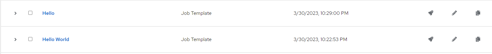

Agora vamos adicionar um projeto do tipo `Workflow` vá até o menu de projetos, clique no botão de adicionar e escolha a opção `Add workflow template`

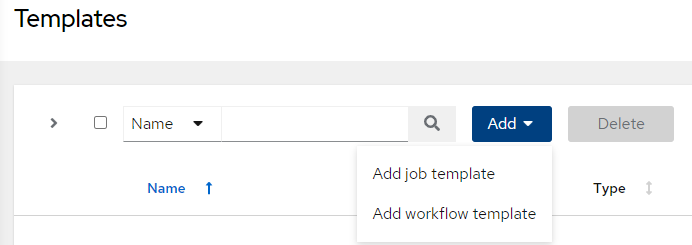

Preencha os dados básicos, e salve o seu `workflow`, no róximo passo vamos acessar as configurações dos passos de execução dele chamamos cada passo de `node`. Repare que para esse teste `NÃO UTILIZAREMOS NENHUM INVENTÁRIO`

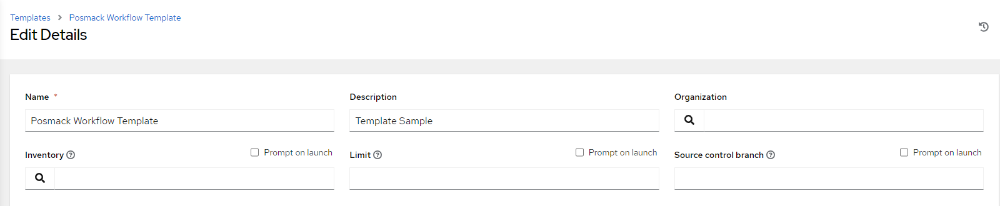

O primeiro passo a ser configurado no nosso `workflow` é justamente sincronizar o nosso repositório.

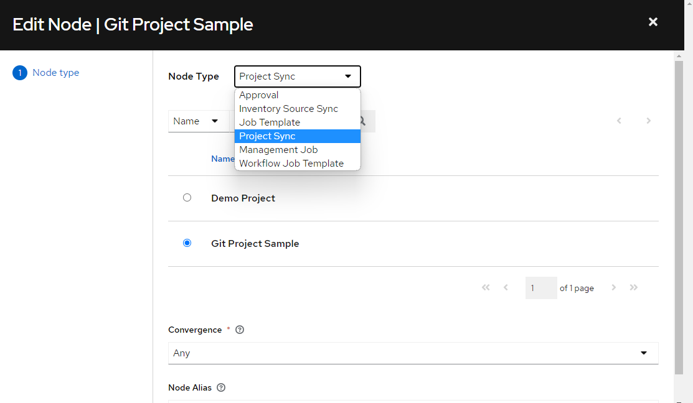

Seu worflow já tem o primeiro `node`

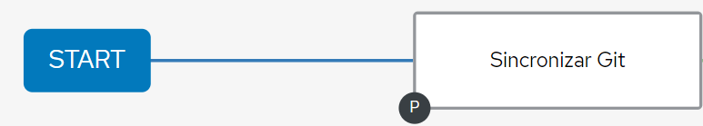

En seguida vamos adicionar um `node` de aprovação, ele fará com que seu `workflow` aguarde uma decisão de um aprovador para direcionar o restante da execução:


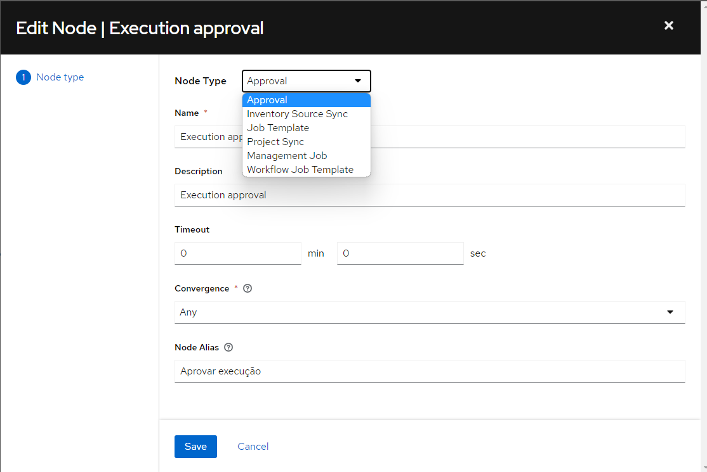

Mais um `node` adicionado ao nosso pequeno `workflow`

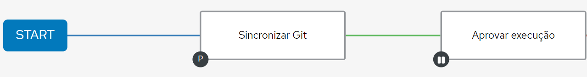

Agora você deve adicionar qual a execução deve ocorrer em caso de sucesso:

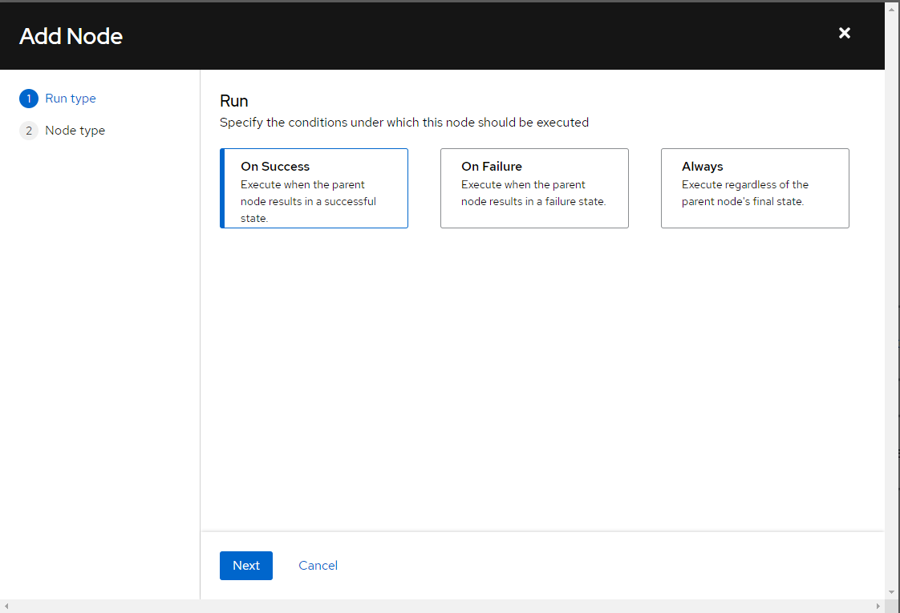

Escolha o Job para ser executado:

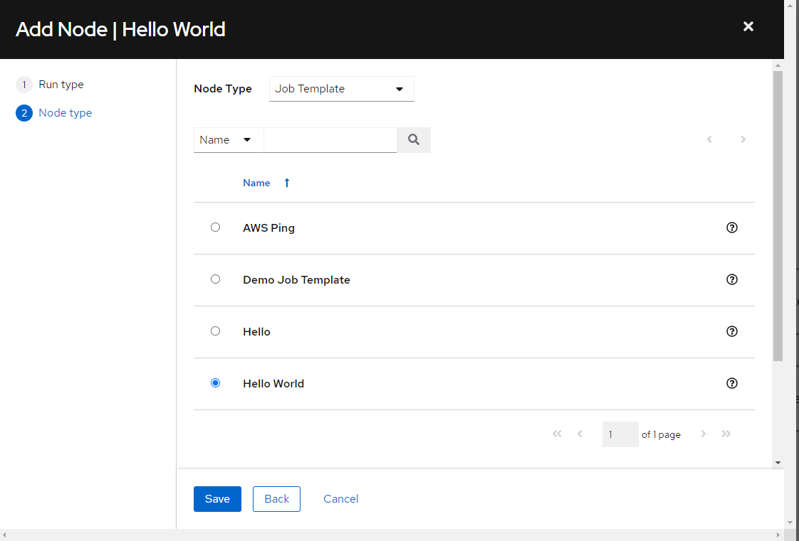

Adicione a operação que será executada em caso de falha:

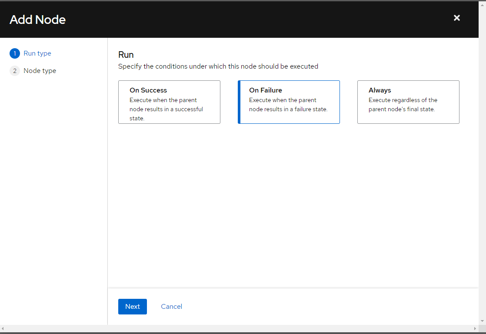

Direcione para o outro Job Template

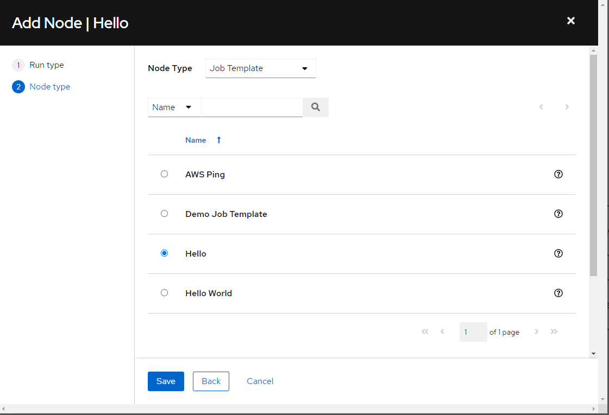

Nosso `workflow` está assim

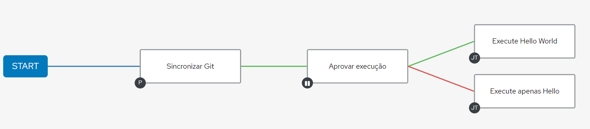

Execute o seu workflow, repare que após asincronização do repositório seu fluxo está parado na etapa de aprovação:

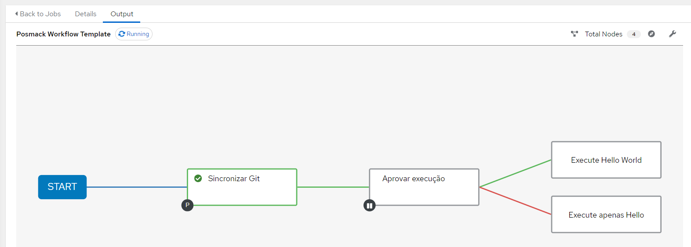

Vá até o menu `Workflow Approvals` e aprove a execução da do restante do `workflow`

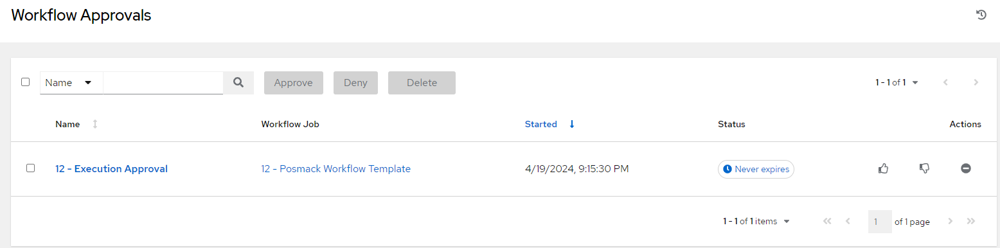

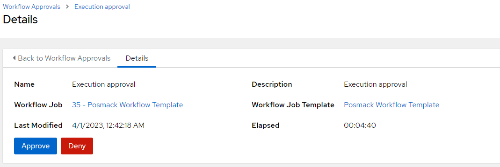

Nosso Workflow executou até o final

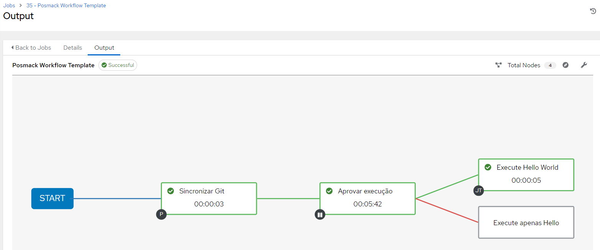

Agora vamos executar novamente, mas quando chegarmos na etapa de aprovação, vamos negar a solicitação para direcionar a execução para o outro `Job Template`.

Oh não, nossos `jobs` falharam e esse não era o resultado esperado.

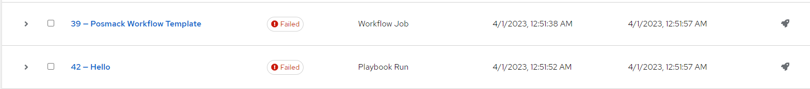

Vamos analisar e descobrir o motivo.

Consultando o `Output` do `Job` que apresenta falhas, temos o conteúdo parecido com este:

```css

PLAY [Hello AWX] ***************************************************************
TASK [Gathering Facts] *********************************************************
ok: [localhost]
TASK [Hello Msg] ***************************************************************
fatal: [localhost]: FAILED! => {"msg": "The task includes an option with an undefined variable. The error was: 'hello_msg' is undefined. 'hello_msg' is undefined\n\nThe error appears to be in '/runner/project/awx-hello.yml': line 5, column 7, but may\nbe elsewhere in the file depending on the exact syntax problem.\n\nThe offending line appears to be:\n\n\n    - name: Hello Msg\n      ^ here\n"}
PLAY RECAP *********************************************************************
localhost                  : ok=1    changed=0    unreachable=0    failed=1    skipped=0    rescued=0    ignored=0   
```

Opa, tem uma dica boa nesse log, aqui diz que o job falhou porque depende de uma variável que não foi encontrada na linha 5 do arquivo `awx-hello.yml`

Analisando o Arquivo, podemos ver que próximo a linha mencionada háa instrução 

```css 
msg: "{{ hello_msg }}" 
```

Ou seja, precisamos fornecer mais informaçõs para que este `Template` possa ser executado com sucesso.

Vamos voltar para nosso `Workflow` e fornecer as informações necessárias utilizando o recurso `Survey`.

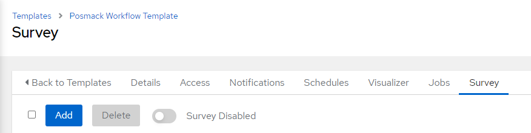

Adicione um `survey` clicando em `add`. você criará uma pergunta a associará a resposta a variável solicitada por seu `Template`, no caso, `hello_msg`.

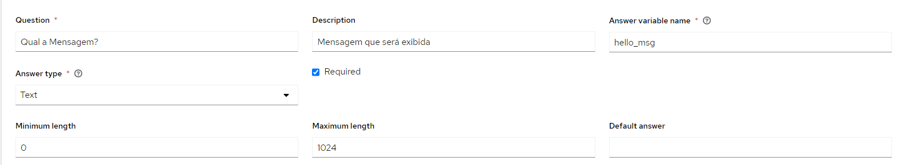

Após salvar sua pergunta, habilite o `Survey` no seu `Workflow Template`

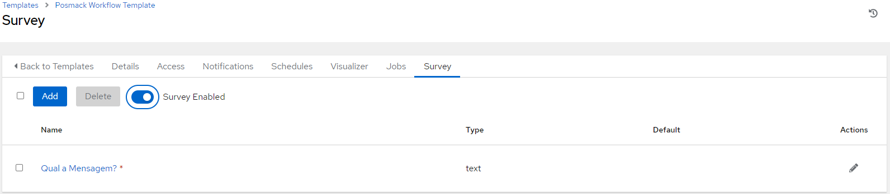

Agora torne a executar o seu `Workflow` e note a diferença.

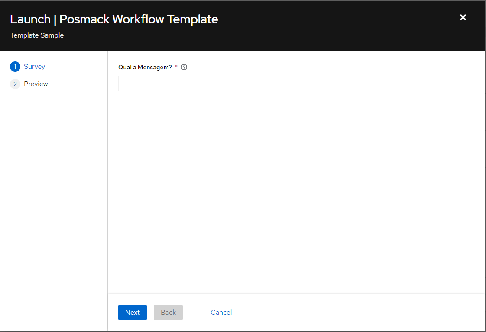

Escreva a mensagem e avance clicando em `next`

Ao ser exibido o preview da exeução, clique em `launch`

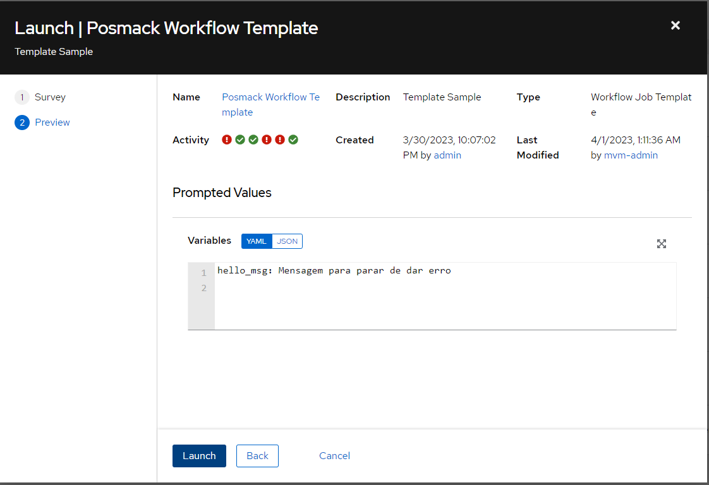

Sucesso, agora nossos 2 cenários de execução estão funcionando sem problemas.

