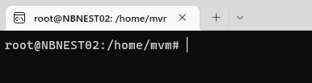
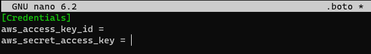
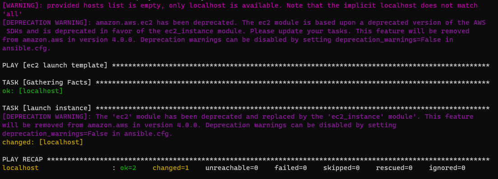
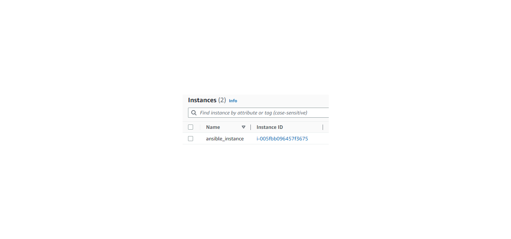

Criando uma instância EC2 (AWS)
==========================================================================================================================================

Requisitos
------------

* [python](01-ubuntu-boto3.md) >= 3.6
* [boto3](01-ubuntu-boto3.md) >= 1.18.0
* [botocore](01-ubuntu-boto3.md) >= 1.21.0

Criar a instância

Abra uma sessão do `bash` na máquina em que você instalou e configurou o `ansible`



Crie um arquivo `.boto` para armazenar as credenciais da AWS, esse arquivo será usado pelo botocore/boto3 no momento da conexão



```console
aws_access_key_id = xxxxxxxxxxxxxxxx
aws_secret_access_key = xxxxxxxxxxxxxxxxxxxxxxxxxxxxxxxxxxxxxxx
```
Caso necessite de maiores informações cobre o seu `aws_access_key_id` e  `aws_secret_access_key`, pode consultar a documentação da [AWS](https://docs.aws.amazon.com/pt_br/IAM/latest/UserGuide/id_credentials_access-keys.html)

no seu diretório de trabalho crie o arquivo `create.yml`

```yaml

- name: ec2 launch template
  hosts: localhost
  connection: local
  tasks:
  - name: launch instance
    ec2:
      instance_type: t2.micro
      key_name: ansible
      image: ami-0b5eea76982371e91
      region: us-east-1
      count: 1
      vpc_subnet_id: subnet-7755d746
      wait: yes
      assign_public_ip: yes
      instance_tags:
        Name: ansible_instance

```

Execute o comando `ansible-playbook` para criar a instância em sua conta da AWS:

    $ ansible-playbook create.yml

O comando irá provisionar uma instância EC2 em sua conta AWS, você poderá checar no link do [console AWS](https://us-east-1.console.aws.amazon.com/ec2/home?region=us-east-1#Instances:)



Ao final, sua instância EC2 estará disponível 



