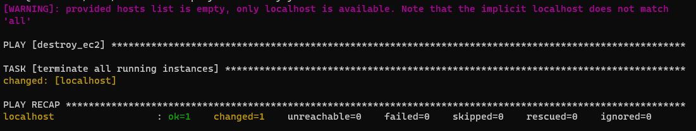
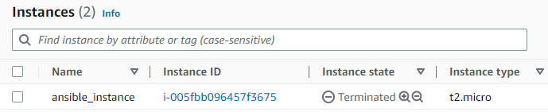

Encerrando uma instância EC2 (AWS)
==========================================================================================================================================


Abra uma sessão do `bash` na máquina em que você instalou e configurou o `ansible`


Crie um arquivo `.boto` para armazenar as credenciais da AWS, esse arquivo será usado pelo botocore/boto3 no momento da conexão


```console
aws_access_key_id = xxxxxxxxxxxxxxxx
aws_secret_access_key = xxxxxxxxxxxxxxxxxxxxxxxxxxxxxxxxxxxxxxx
```
Caso necessite de maiores informações cobre o seu `aws_access_key_id` e  `aws_secret_access_key`, pode consultar a documentação da [AWS](https://docs.aws.amazon.com/pt_br/IAM/latest/UserGuide/id_credentials_access-keys.html)

no seu diretório de trabalho crie o arquivo `destroy.yml`

Ao encerrar instâncias EC2 você poderá optar por determinar o id da instância que será encerrada
```yaml

- name: ec2 provisioning using Ansible
  hosts: localhost
  connection: local
  gather_facts: False

- hosts: localhost
  gather_facts: False
  connection: local
  vars:
    - region: 'us-east-1'
    - ec2_id: 'i-0c17dabc6b72cbca2'
  tasks:
    - name: Terminate instances
      local_action: ec2
        state='absent'
        instance_ids='{{ ec2_id }}'
        region='{{ region }}'
        wait=True

```
Ou poderá utilzar o recurso de filtros para encerrar uma ou mais instências que obeceçam ao critério
```yaml

- name: destroy_ec2
  hosts: localhost
  connection: local
  gather_facts: no
  tasks:
    - name: terminate all running instances
      amazon.aws.ec2_instance:
        region: us-east-1
        state: absent
        filters:
          tag:Name: ansible_instance
          instance-state-name: running

```

Execute o comando `ansible-playbook` para eliminar a(s) instância(s) em sua conta da AWS:

    $ ansible-playbook destroy.yml

O comando irá provisionar uma instância EC2 em sua conta AWS, você poderá checar no link do [console AWS](https://us-east-1.console.aws.amazon.com/ec2/home?region=us-east-1#Instances:)



Ao final, sua instância EC2 estará disponível 



