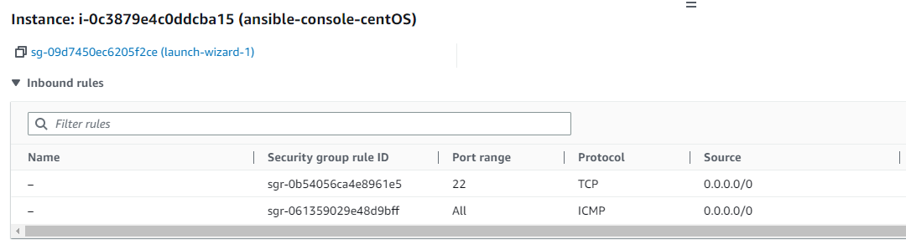
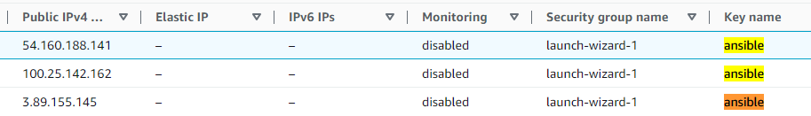
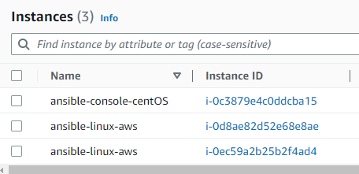
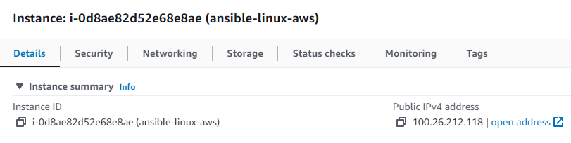

Configurando o seu inventario (hosts/groups)
==========================================================================================================================================


Automatiza tarefas em nós geridos ou `hosts` na sua infra-estrutura, utilizando uma lista ou grupo de listas conhecidas como inventário. Pode passar nomes de `hosts` na linha de comando, mas a maioria dos utilizadores Ansible cria diretórios de inventário. O seu inventário define os nós geridos que automatiza, com `groups` para que possa executar tarefas de automatização em múltiplos `hosts` ao mesmo tempo. Uma vez definido o seu inventário, utiliza [patterns](https://docs.ansible.com/ansible/latest/inventory_guide/intro_patterns.html#intro-patterns) para seleccionar os `hosts` ou `groups` contra os quais quer que o Ansible seja executado.

**Como podemos construir nosso inventário**
--------------------------------------------------------------
O inventário mais simples é um único diretório com uma lista de `hosts` e `groups`. A localização padrão para este diretório é `/etc/ansible/hosts`. Pode especificar um diretório de inventário diferente na linha de comando utilizando a opção `-i <caminho>` ou na configuração utilizando `inventory`.

[Plugins de inventário](https://docs.ansible.com/ansible/latest/plugins/inventory.html#inventory-plugins) suportam uma gama de formatos e fontes para tornar o seu inventário flexível e personalizável. À medida que o seu inventário se expande, poderá precisar de mais do que um único diretório para organizar os seus `hosts` e `groups`. Aqui estão três opções para além do diretório `/etc/ansible/hosts`: - Pode criar um diretório com múltiplos diretórios de inventário. Ver [Organizar inventário num diretório](https://docs.ansible.com/ansible/latest/inventory_guide/intro_inventory.html#inventory-directory). Estes podem utilizar formatos diferentes (YAML, ini, e assim por diante). - Pode puxar o inventário de forma dinâmica. Por exemplo, pode usar um plugin de inventário dinâmico para listar recursos em um ou mais fornecedores de nuvem. Ver [Trabalhar com inventário dinâmico](https://docs.ansible.com/ansible/latest/inventory_guide/intro_dynamic_inventory.html#intro-dynamic-inventory). - Pode utilizar múltiplas fontes para inventário, incluindo tanto o inventário dinâmico como os diretórios estáticos. Ver [Aprovação de múltiplas fontes de inventário](#utilização de múltiplas fontes de inventário).

**Configurando o arquivo de `hosts` e autenticação por chaves assimétricas**
--------------------------------------------------------------------------------------------

A seguir faremos um passo a passo para construirmos nosso inventário via arquivo de `hosts` do `ansible` habilitando a comunicação entre os servidores utilizando troca de chaves assimétricas.

Para nosso exemplo, precisaremos configurar um console do `ansible` e 2 servidores que farão parte de nosso inventário em `/etc/ansible/hosts`. Faça a configuração de ser console do ansible utilizando as referências deste repositótio [Instalação](00-install.md0) ou [instância de Ubuntu/Ansible](01-ubuntu-boto3.md)

Em seguida, crie 2 instâncias independentes para que nosso console do `ansible` possa interagir. No nosso caso utilizarei instâncias `CentoOS` para montar este cenário, mas você pode utilizar a distribuição que mais se sinta mais confortável, porém algumas sintaxes utilizadas neste estudo podem necessitar de customizações para que possamos concluí-lo com sucesso

Para que todas instâncias sejam acessadas a partir de minha máquina local, foram necessárias algumas configurações no momento da criação de cada uma delas.

### Security Group

Configuramos todas as instâncias com acesso via `ssh` e possibilidade de verificação de disponibilidade via `ping`:



Caso suas instâncias não possuam estas regras de acesso liberadas, algumas ou todos os passos desse estudo não serão executados com sucesso.

### Chaves de Acesso (Key Pair)

Certifique-se de criar todas as instâncias com a mesma chave de acesso, isso não é obrigatório e pode ser que em ambientes produtivos não seja recomendado, mas facilitará nosso estudo e a execução dos passos a seguir:



Você deve salvar a chave em um diretório local e garantir que suas chaves estejam seguras utilizando o comando de alteração de permissões do linux:

```console

chmod 400 ansible.pem

```


**Passo 1 - Obtendo os endereços `IPs`**
-----------------------------------------

Utilizando a estrutura da AWS, temos nosso 3 servidores configurados:



Por padrão, a AWS atribui 2 endereços `IPV4` para cada instância sendo um deles público e outro privado, para interações entre os servidores utilizando uma sessão `bash` de dentro do console `AWS` os endereços privados são suficientes para que os servidores possam ser acessados, podemos obter mais detalhes na documentação da `AWS` [Ip Addressing](https://docs.aws.amazon.com/AWSEC2/latest/UserGuide/using-instance-addressing.html). Como nesse exercício faremos o acesso aos servidores via ssh a partir de uma máquina local, utilizaremos os endereços `IPV4` públicos.



## Observação:
>Endereços públicos de susas instâncias podem ser dinâmicos, ou seja, serem alterados sempre que um `boot` for executado, existem formas de fixarmos esses endereços, porém, sempre incorrerão em custos adicionais para as aplicações, os endereços privados, apesar de terem limitações quanto ao acesso, oferecem um controle maior para os administradores de rede, podendo ser fixados em cada instância sem a necessidade de expô-los para fora do ambiente em que está configurado.