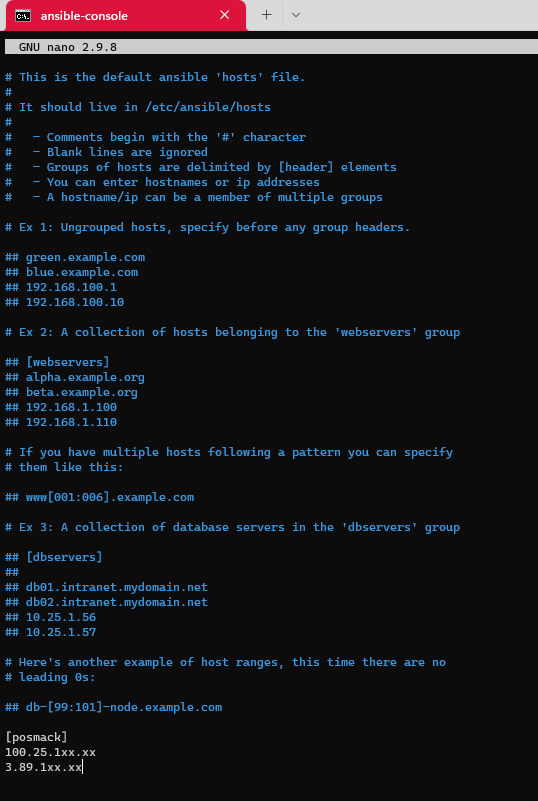
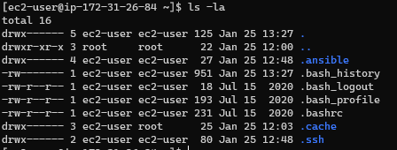
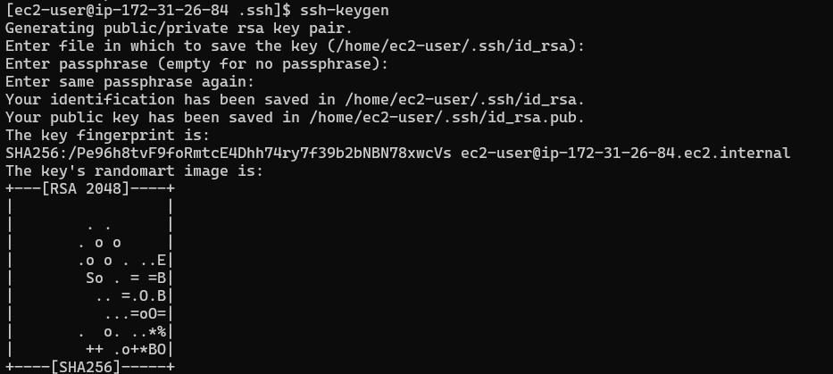
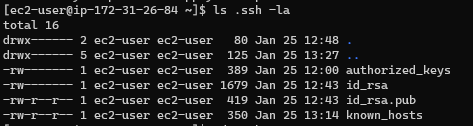
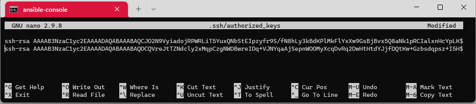
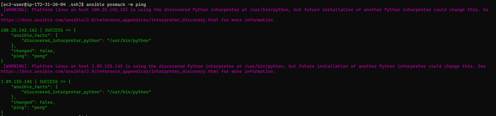
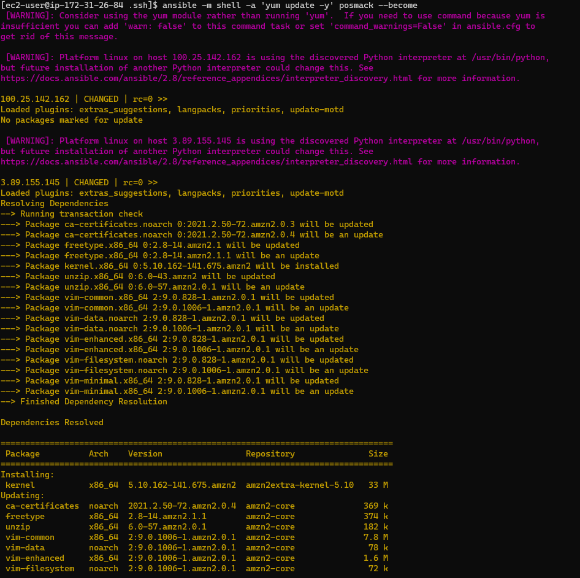
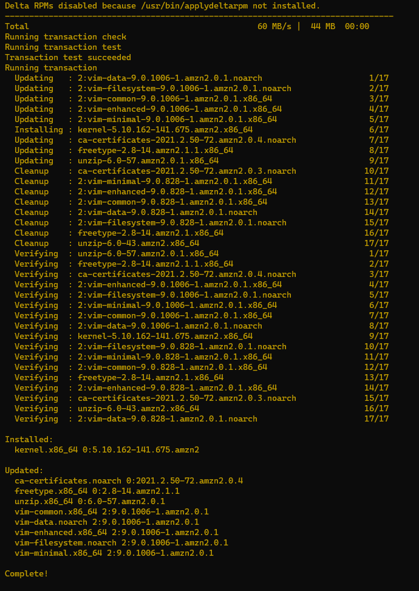

Configurando o seu inventario (hosts/groups)
==========================================================================================================================================


Automatiza tarefas em nós geridos ou `hosts` na sua infra-estrutura, utilizando uma lista ou grupo de listas conhecidas como inventário. Pode passar nomes de `hosts` na linha de comando, mas a maioria dos utilizadores Ansible cria diretórios de inventário. O seu inventário define os nós geridos que automatiza, com `groups` para que possa executar tarefas de automatização em múltiplos `hosts` ao mesmo tempo. Uma vez definido o seu inventário, utiliza [patterns](https://docs.ansible.com/ansible/latest/inventory_guide/intro_patterns.html#intro-patterns) para seleccionar os `hosts` ou `groups` contra os quais quer que o Ansible seja executado.

**Como podemos construir nosso inventário**
--------------------------------------------------------------
O inventário mais simples é um único diretório com uma lista de `hosts` e `groups`. A localização padrão para este diretório é `/etc/ansible/hosts`. Pode especificar um diretório de inventário diferente na linha de comando utilizando a opção `-i <caminho>` ou na configuração utilizando `inventory`.

[Plugins de inventário](https://docs.ansible.com/ansible/latest/plugins/inventory.html#inventory-plugins) suportam uma gama de formatos e fontes para tornar o seu inventário flexível e personalizável. À medida que o seu inventário se expande, poderá precisar de mais do que um único diretório para organizar os seus `hosts` e `groups`. Aqui estão três opções para além do diretório `/etc/ansible/hosts`: - Pode criar um diretório com múltiplos diretórios de inventário. Ver [Organizar inventário num diretório](https://docs.ansible.com/ansible/latest/inventory_guide/intro_inventory.html#inventory-directory). Estes podem utilizar formatos diferentes (YAML, ini, e assim por diante). - Pode puxar o inventário de forma dinâmica. Por exemplo, pode usar um plugin de inventário dinâmico para listar recursos em um ou mais fornecedores de nuvem. Ver [Trabalhar com inventário dinâmico](https://docs.ansible.com/ansible/latest/inventory_guide/intro_dynamic_inventory.html#intro-dynamic-inventory). - Pode utilizar múltiplas fontes para inventário, incluindo tanto o inventário dinâmico como os diretórios estáticos. Ver [Aprovação de múltiplas fontes de inventário](#utilização de múltiplas fontes de inventário).

**Configurando o arquivo de `hosts` e autenticação por chaves assimétricas**
--------------------------------------------------------------------------------------------

A seguir faremos um passo a passo para construirmos nosso inventário via arquivo de `hosts` do `ansible` habilitando a comunicação entre os servidores utilizando troca de chaves assimétricas.

Para nosso exemplo, precisaremos configurar um console do `ansible` e 2 `servidores` que farão parte de nosso inventário em `/etc/ansible/hosts`. Faça a configuração de ser console do ansible utilizando as referências deste repositótio [Instalação](00-install.md0) ou [instância de Ubuntu/Ansible](01-ubuntu-boto3.md)

Em seguida, crie 2 instâncias independentes para que nosso console do `ansible` possa interagir. No nosso caso utilizarei instâncias `CentoOS` para montar este cenário, mas você pode utilizar a distribuição que mais se sinta mais confortável, porém algumas sintaxes utilizadas neste estudo podem necessitar de customizações para que possamos concluí-lo com sucesso

Para que todas instâncias sejam acessadas a partir de minha máquina local, foram necessárias algumas configurações no momento da criação de cada uma delas.

### Security Group

Configuramos todas as instâncias com acesso via `ssh` e possibilidade de verificação de disponibilidade via `ping`:


Caso suas instâncias não possuam estas regras de acesso liberadas, algumas ou todos os passos desse estudo não serão executados com sucesso.

### Chaves de Acesso (Key Pair)

Certifique-se de criar todas as instâncias com a mesma chave de acesso, isso não é obrigatório e pode ser que em ambientes produtivos não seja recomendado, mas facilitará nosso estudo e a execução dos passos a seguir:


Você deve salvar a chave em um diretório local e garantir que suas chaves estejam seguras utilizando o comando de alteração de permissões do linux:

```console

chmod 400 ansible.pem

```


**Passo 1 - Obtendo os endereços `IPs`**
-----------------------------------------

Utilizando a estrutura da AWS, temos nosso 3 servidores configurados:


Por padrão, a AWS atribui 2 endereços `IPV4` para cada instância sendo um deles público e outro privado, para interações entre os servidores utilizando uma sessão `bash` de dentro do console `AWS` os endereços privados são suficientes para que os servidores possam ser acessados, podemos obter mais detalhes na documentação da `AWS` [Ip Addressing](https://docs.aws.amazon.com/AWSEC2/latest/UserGuide/using-instance-addressing.html). Como nesse exercício faremos o acesso aos servidores via `ssh` a partir de uma máquina local, utilizaremos os endereços `IPV4` públicos.


## Observação:
>Endereços públicos de instâncias podem ser dinâmicos, ou seja, serem alterados sempre que um `boot` for executado, existem formas de fixarmos esses endereços, porém, sempre incorrerão em custos adicionais para as aplicações. Os endereços privados, apesar de terem limitações quanto ao acesso, oferecem um controle maior para os administradores de rede, podendo ser fixados em cada instância sem a necessidade de expô-los para fora do ambiente em que está configurado.

**Passo 2 - Configurando o seu arquivo de `hosts`**
----------------------------------------------------

Uma vez que você já tenha obtido os endereços de seus `servidores` inicie uma sessão `bash` utilizando o as configurações de `ssh` de sua instância de console `ansible` (Lembre-se de certificar-se de possuir o endereço e usuário corretos, além da Chave de acesso necessário para realizar a conexão) e você poderá verificar que o seu console possui um diretório `/etc/ansible/`. Nesse diretório residem os arquivos de configuração padrão do `ansible`.


Neste exercício, trataremos do arquivo `/etc/ansible/hosts` que já faz parte das configurções padrão, porém, não possui nenhum conteúdo que identifique o nosso inventário de `servidores`.

```
# This is the default ansible 'hosts' file.
#
# It should live in /etc/ansible/hosts
#
#   - Comments begin with the '#' character
#   - Blank lines are ignored
#   - Groups of hosts are delimited by [header] elements
#   - You can enter hostnames or ip addresses
#   - A hostname/ip can be a member of multiple groups

# Ex 1: Ungrouped hosts, specify before any group headers.

## green.example.com
## blue.example.com
## 192.168.100.1
## 192.168.100.10

# Ex 2: A collection of hosts belonging to the 'webservers' group

## [webservers]
## alpha.example.org
## beta.example.org
## 192.168.1.100
## 192.168.1.110

# If you have multiple hosts following a pattern you can specify
# them like this:

## www[001:006].example.com

# Ex 3: A collection of database servers in the 'dbservers' group

## [dbservers]
##
## db01.intranet.mydomain.net
## db02.intranet.mydomain.net
## 10.25.1.56
## 10.25.1.57

# Here's another example of host ranges, this time there are no
# leading 0s:

## db-[99:101]-node.example.com


```

como você pode observar, o arquivo de `hosts` apresenta alguns exemplos de configuração, vamos adicionar nossa configuração de `servidores` utilizando o modelo de `groups`.

```
[group_name] --> Nome do grupo de servidores (Ex.: DBServers, Linux_CentOS, WebServers, Ubuntu_Servers...)
200.196.1xx.xxx --> Endereço do Servidor 1
200.147.2xx.xx --> Endereço do Servidor 2
.
.
.

```

Para montar este exercício (Lembrando que os IPs público são dinâmicos), adicionei as linhas ao final do arquivo de `hosts`

```

[posmack]
100.25.1xx.xxx
3.89.1xx.xxx

```

Salve o arquivo com as configurações do seu ambiente:



A partir deste momento, o `ansible` é capaz de identificar o grupo de servidores chamado `posmack` e realizar as tarefas que designarmos para aquele grupo de servidores, porém, isso não é suficiente.

Vamos precisar indicar como o console do `ansible` vai autenticar-se em cada um dos servidores. Existem muitas formas de promovermos a autenticação entre servidores e não exploraremos todas elas, na documentação do [Ansible](Doc/01-ansible.md) você encontrará algumas formas de autenticação via linha de comando, mas para o nosso estudo, utilizaremos a autenticação por meio troca de chaves assimétricas.

**Passo 3 - Troca de chaves entre servidores - Gerar Chave**
------------------------------------------------------------

Este também é um tema bastante extenso e não precisamos esgotar o assunto nesse exercício, vamos apenas apresentar uma forma rápida de permitir que 2 máquinas possam estabelecer uma conexão por meio de uma identificação confiável entre elas.

Para iniciarmos o processo, uma das máquinas, aquela que deseja estabelecer a conexão, precisa possuir uma _chave de identificação_, uma espécie de certificado que atesta uma identidade para outros servidores.

No nosso exemplo, vamos utilizar um gerador dessa identificação fornecido pelo `linux`, o comando `ssh-keygen`.

Para executar o comando `ssh-keygen` recomendamos que você verifique se o seu console `ansible` possui a pasta `.ssh` para o usuário ativo, no nosso cenário, o usuário é  `ec2-user`.



## Observação:
>caso este diretório não exista é bem provável que a instalação possa estar incompleta ou corrompida, sendo assim, os passos seguintes podem não funcionar corretamente. 

ao exibir o conteúdo do diretório, certifique-se de que exista apenas o arquivo `authorized_keys`, assim você garante que a chave que estamos prestes a gerar não interferirá em quaisquer outras configurações que você possa ter em sua instância ou em outros servidores.

Acesse o diretório `.ssh` execute o comando `ssh-keygen` 

```console

cd .ssh
ssh-keygen

```


Após a execução, você poderá notar que alguns arquivos foram gerados no diretório `.ssh`



Os arquivos gerados contém as chaves públicas e privadas para o usuário `ec2-user` no console `ansible`, para configurarmos essa credencial como um acesso confiável em outras máquinas, precisamos do conteúdo da chave pública, no nosso caso, do arquivo `id_rsa.pub`

```console

cat id_rsa.pub

```

Copie o conteúdo do arquivo, você precisará dessa sequência de caractere para configurar esta credencial dentro dos seus `servidores`, aqueles que foram adicionados no arquivo de `hosts`.

**Passo 4 - Troca de chaves entre servidores - Exportar Chave**
------------------------------------------------------------

Agora que já geramos as chaves públicas e privadas do usuário `ec2-user` do nosso console `ansible` precisamos informar essa credencial a todos os servidores com os quais desejamos estabelecer conexão.

Precisamos abrir uma sessão `ssh` com os `servidores` e verificar se temos o usuário `ec2-user` em todos eles, isso facilitará a conexão, pois não precisaremos informar o usuário em cada comando que queremos executar.

Em cada um de nossos `servidores` devemos ter a pasta `.ssh` para o usuário `ec2-user` nesta pasta, vamos editar o arquivo `authorized_keys` e incluir o conteúdo copiado.

```console

nano .ssh/authorized_keys

```



Devemos repetir esta operação para cada servidor de nosso inventário e executar esta exportação de chave sempre que adicionarmos uma nova máquina ao nosso inventário.

**Passo 5 - Testar Conexão via ansible**
------------------------------------------------------------

Quando chegamos nesse ponto, cada endereço de nosso inventário de `servidores` deve estar acessível para executarmos os comando do `ansible`. A forma mais simples de testarmos é utilizarmos um módulo do `ansible` chamado `ping`.

Existe uma diferença entre o _ping_ tradicional dos sistemas operacionais que conhecemos e o módulo `ping` do `ansible`, enquanto o comando tradicional apenas verifica se um endereço pode ser alcançado, o módulo do `ansible` verifica também se este endereço pode ser acessado pelo `ansible`, ou seja, se o `ansible` será capaz de estabelecer uma conexão estável com aquele endereço.

O comando `ansible` possui parâmetros para ser executado, um deles é o módulo, a documentação mais detalhada pode ser acessada a partir desse [Repositório](Doc/01-ansible.md), aqui utilizaremos uma de suas formas mais simples de execução:


```console

ansible [nome do grupo] -m ping

```

nessa execução os parâmetros passados são o nome do grupo de servidores que cadastramos no arquivo `/etc/ansible/hosts`, neste estudo, o grupo é `posmack`, depois adicionamos o parâmetro -m para indicar que utilizaremos um dos módulos do `ansible` para interagir com nossos `servidores` e em seguida especificamos que o módulo que queremos utilizar é o `ping`

```console

ansible posmack -m ping

```




## Observação:
> O `ansible` possui uma quantidade muito grande de módulos e você pode aprofundar seus estudos verificando a [documentação](https://docs.ansible.com/ansible/2.9/modules/list_of_all_modules.html) disponível no site da plataforma.


**Passo 6 - Promovendo interações nos nosso `servidores`**
------------------------------------------------------------

Agora que garantimos que o acesso a todos os nossos `servidores` é possível, podemos começar a promover alterações que sejam comuns a todas as máquinas, Vamos usar um exemplo do dia a dia de qualquer administrador, atualizar os pacotes de instalação de todas as instâncias de um grupo ou de todo o nosso inventário.

Utilizando outros [módulos](https://docs.ansible.com/ansible/2.9/modules/list_of_all_modules.html) do `ansible` temos a possibilidade de executarmos ações dentro de cada máquina a partir de nosso console `ansible` sem a necessidade de nos conectarmos manualmente com cada uma delas, vamos ao exemplo de utilização do módulo `shell`, sua [documentação](https://docs.ansible.com/ansible/2.9/modules/shell_module.html#shell-module) pode ser acessada no site da plataforma.


```console

ansible -m <nome do módulo> -a <'MODULE_ARGS'> [nome do grupo] [OPTIONS]

```

Como nosso exercício visa atualizar os pacotes dos `servidores` que constam no nosso grupo `posmack` precisamos executar o comando `yum update` (CentOS), vamos acrescentar a opção (OPTIONS) DE `--become` para que seja executado o comando com privilégios de `root`, desta forma, nosso comando ficaria assim:

```console

ansible -m shell -a 'yum update -y' posmack --become

```

O `ansible` se encarrega de verificar quais são os `servidores` que fazem parte do grupo `posmack`, faz a conexão com cada uma das máquinas, autentica o usuário corrente e executa o comando desejado.



Reparem que, propositalmente, no caso desse exercício, os 2 `servidores` não possuiam a mesma configuração, no primeiro deles o comando de `update` verificou que todos os pacotes estavam em sua última versão, enquanto o segundo necessitou de várias atualizações, ao final, o `ansible` informa que a execução do modulo está completa.



Agora podemos explorar outras possibilidades, instalar pacotes, alterar configurações, criar ou remover dados ou recursos de nosso parque inventariado.

_fonte_: _https://docs.ansible.com/ansible/latest/inventory_guide/intro_inventory.html#inventory-directory_ 
