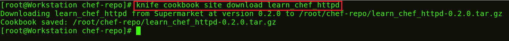
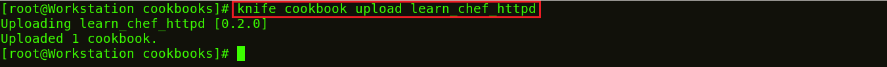
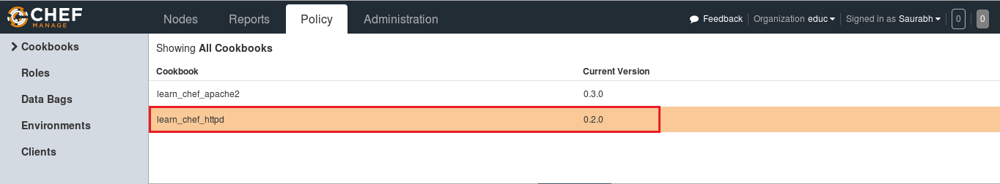
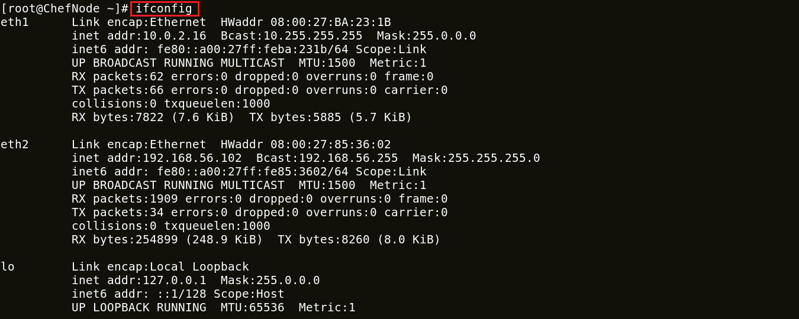
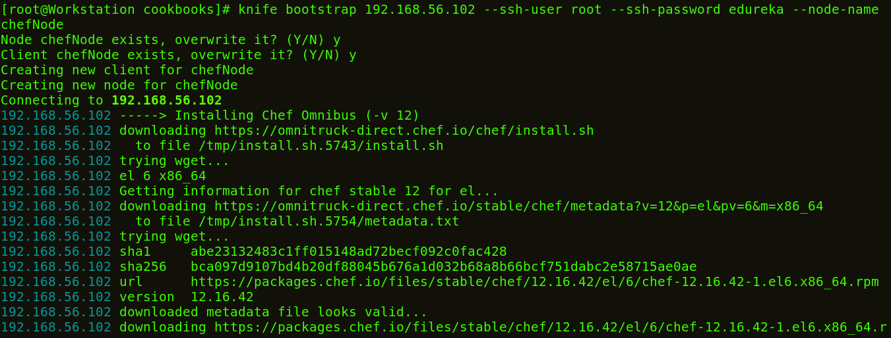
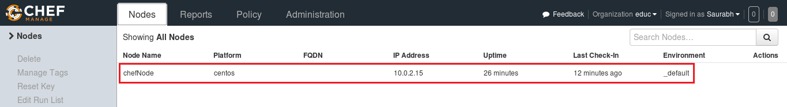
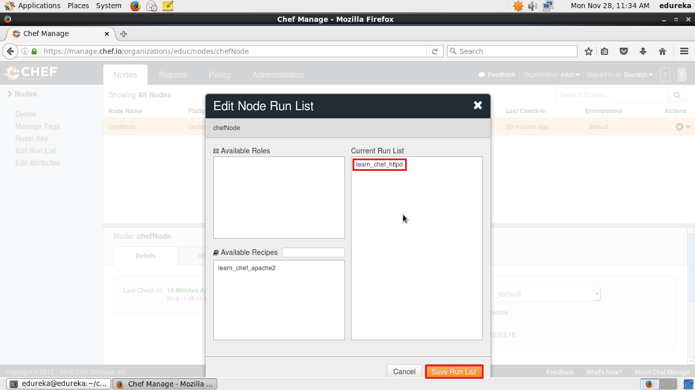

**Instalar Chef**
-----------------

Você está ansioso para se tornar um [_**Certified Professional in DevOps**_](https://www.edureka.co/devops)? Bem, se a resposta for sim, deixe-me dizer que você precisa dominar todas as principais ferramentas do DevOps. Uma dessas ferramentas fora do lote é o Chef. Portanto, este blog é um guia sobre como instalar o Chef em uma máquina CentOS. Instalar o Chef é como uma caminhada no bolo, você só precisa executar alguns comandos.

Chef tem três componentes principais:

1. Workstations
2. Server
3. **_Nodes_**

Para fins de demonstração, usarei apenas um aplicativo Node. Pode haver centenas de **_Nodes_** gerenciados por um Chef Server. Estou usando duas CentOS Virtual Images, uma para Workstation e outra para um Node. Para Server, usarei a versão hospedada do Chef Server (na nuvem) disponível em [_**manage. chefe de cozinha. eu mesmo**_](http://manage.chef.io)

A seguir estão as etapas para instalar o Chef:

1. Instale o Chef DK (kit de desenvolvimento) na Workstations do Chef
2. Configure um Chef Server
3. Crie uma **_Recipe_** ou um **_Cookbook_** / baixe um **_Cookbook_** do Chef Supermarket na Workstations
4. Carregue um **_Cookbook_** no Chef Server
5. Conecte um **_Node_** ao Chef Server
6. Implante o **_Cookbook_** do Server para o **_Node_**

**1\. Instale o Chef DK (kit de desenvolvimento)**
-----------------------------------------

Na minha Workstations do Chef, instalarei o Chef DK. O Chef DK é um pacote que contém todas as ferramentas de desenvolvimento necessárias para codificar o Chef. Aqui está o link para baixar _**[Chef DK](https://downloads.chef.io/chef-dk/)**_.

Aqui, escolha o sistema operacional que você está usando. Estou usando o CentOS 6.8. Então, clicarei em **Red Hat Enterprise Linux**.

Copie o link de acordo com a versão do CentOS que você está usando. Estou usando o CentOS 6, como você pode ver que destaquei na captura de tela acima.

Vá para o terminal da Workstations e baixe o Chef DK usando o comando wget e cole o link.

**Execute este comando:**

1

`wget https:``/``/``packages.chef.io``/``stable``/``el``/``6``/``chefdk``-``1.0``. ``3``-``1.el6``.x86_64.rpm`

O pacote agora está baixado. Agora vou instalar este pacote usando rpm.

**Execute isto:**

1

`rpm` `-``ivh chefdk``-``1.0``.``3``-``1.el6``.x86_64.rpm`

**2\. Configurar Chef Server**
-------------------------

Usarei a versão hospedada do Chef Server na nuvem, mas você também pode usar uma máquina física. Este Chef-Server está presente em [**manage.chef.io**](http://manage.chef.io)

Aqui, crie uma conta se você não tiver uma. Depois de criar uma conta, faça login com suas credenciais de login.

É assim que o Chef Server se parece.

Se você estiver entrando pela primeira vez, a primeira coisa que fará será criar uma organização. A organização é basicamente um grupo de máquinas que você gerenciará com o Chef Server.

Primeiro, irei para a guia de administração. Lá, já criei uma organização chamada edu. Portanto, preciso baixar o kit inicial na minha Workstations. Este kit inicial ajudará você a enviar arquivos da Workstations para o Chef Server. Clique no ícone de configurações no lado direito e clique em Starter Kit.

Agora você terá a opção de baixar o Starter Kit. Basta clicar nele para baixar o arquivo zip do Starter Kit.

Mova este arquivo para seu diretório raiz. Agora descompacte este arquivo usando o comando unzip em seu terminal. Você notará que ele inclui um diretório chamado chef-repo.

**Execute isto:**

1

`unzip chef``-``starter.``zip`

Agora mova este kit inicial para o diretório do **_Cookbook_** no diretório chef-repo.

**Execute isto:**

1

`mv starter` `/``root``/``chef``-``repo``/``**_Cookbooks_**`

**3\. Faça o download de um **_Cookbook_** do Chef Supermarket na Workstations**
-------------------------------------------------- --------------

Os **_Cookbooks_** do Chef estão disponíveis no Supermercado Cookbook, podemos ir ao Supermercado Chef. Baixe os **_Cookbooks_** necessários em [_**supermarket.chef.io**_](http://supermarket.chef.io). Estou baixando um dos **_Cookbooks_** para instalar o Apache de lá.

**Execute isto:**

1

2

`cd chef``-``repo`

`knife cookbook site download learn_chef_httpd`

Existe Tar ball baixado para o Apache Cookbook. Agora, vou extrair o conteúdo deste arquivo Tar baixado. Para isso, usarei o comando tar.

**Execute isto:**

1

`tar` `-``xvf learn_chef_httpd``-``0.2``.``0.tar``.gz`

Todos os arquivos necessários são criados automaticamente neste **_Cookbook_**. Não há necessidade de fazer nenhuma modificação. Vamos verificar a descrição da **_Recipe_** dentro da minha pasta de **_Recipe_**s.

**Execute isto:**

1

2

`cd` `/``root``/``chef``-``repo``/``learn_chef_httpd``/``recipes`

`cat default.rb`

Agora, vou apenas carregar este **_Cookbook_** para o meu Chef Server, pois parece perfeito para mim.

**4\. Carregar um **_Cookbook_** no Chef Server**
---------------------------------------------

Para carregar o Apache Cookbook que baixei, primeiro mova este arquivo learn\_chef\_httpd para a pasta Cookbooks no chef-repo. Em seguida, altere seu diretório para **_Cookbooks_**.

**Execute isto:**

1

2

`mv` `/``root``/``chef``-``repo``/``learn_chef_httpd` `/``root``/``chef``-``repo``/``**_Cookbooks_** `

`cd` `/``root``/``chef``-``repo``/``**_Cookbooks_**`

Agora neste diretório, execute o comando abaixo para carregar o Apache Cookbook:

**Execute isto:**

1

`knife cookbook upload learn_chef_httpd`

Verifique o Cookbook no console Chef Server Management. Na seção de política, você encontrará o **_Cookbook_** que você carregou. Consulte a captura de tela abaixo:

Agora, nossa etapa final é adicionar o Chef Node. Configuramos uma Workstations, um Chef Server e precisamos adicionar nossos **_Nodes_** ao Chef Server para automação.

**5\. Conecte um **_Node_** ao Chef Server**
-----------------------------------------

A cor do terminal da minha máquina Node é diferente da Workstations para que você possa diferenciar entre ambos.

Eu só preciso do endereço IP do meu Node para isso vou executar o comando abaixo na minha máquina Node.

**Execute isto:**

1

`ifconfig`

Adicionarei meu Chef Node ao Server executando o comando Knife Bootstrap no qual especificarei o endereço IP do The Chef Node e seu nome. Execute o comando mostrado abaixo:

**Execute isto:**

1

`knife bootstrap` `192.168``.``56.102` `-``-``ssh``-``root do usuário` `-``-``ssh``-``senha edureka` `-``- ``**_Node_**``-``nome chefNode`

Este comando também inicializará a instalação do Chef-Client no Chef Node. Você pode verificá-lo na CLI na Workstations usando o comando faca, conforme mostrado abaixo:

**Execute isto:**

1

`Knife node` `list`

Você também pode verificar no Chef Server. Vá para a guia **_Nodes_** no console de gerenciamento do Server, aqui você notará que o **_Node_** que você adicionou está presente. Consulte a captura de tela abaixo:

**6\. Implante o **_Cookbook_** do Server para o **_Node_****
-------------------------------------------------- -----

Vamos ver como podemos adicionar um Cookbook ao Node e gerenciar sua lista de execução no Chef Server. Run List descreve a ordem na qual os Cookbooks devem ser executados. Como você pode ver na captura de tela abaixo, clique na guia Actions e selecione a opção Edit Run list para gerenciar a lista Run.

Nas **_Recipe_**s Disponíveis,  você pode ver nossa **_Recipe_** learn\_chef\_httpd, você pode arrastá-la dos pacotes disponíveis para a Lista de Execuções atual e salvar a lista de Execuções.

Agora faça o login no seu Node e apenas execute o chef-client para executar a lista de execução.

**Execute isto:**

1

`chef``-``client`

**Parabéns!** você instalou o Chef com sucesso e implantou o Apache do Chef Server no Node.

Espero que você tenha conseguido me acompanhar durante o processo de instalação do Chef e agora o Chef deve estar instalado e funcionando em sua máquina.

_fonte_: _https://www.edureka.co/blog/install-chef/_

[Introduçao](00-intro.md)