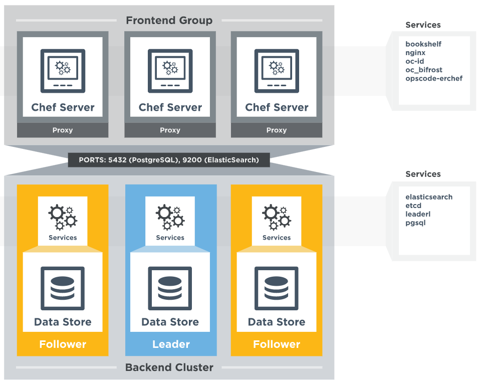

**Tutorial do Chef**
-----------------

Neste tutorial do Chef, os seguintes tópicos serão abordados:

* [Chef Architecture](#chef_architecture)
* Demonstração [prática](#hands_on)

A primeira seção deste blog Tutorial do Chef explicará detalhadamente a arquitetura do Chef, o que esclarecerá todas as suas dúvidas.

**Tutorial do Chef – Arquitetura do Chef**
-------------------------------------

Conforme mostrado no diagrama abaixo, existem três componentes principais do Chef:

* Workstation
* Server
* Nodes

**Tutorial do Chef - workstation**

A workstation é o local de onde todas as configurações do Chef são gerenciadas. Esta máquina contém todos os dados de configuração que podem ser posteriormente enviados para o Chef Server central. Essas configurações são testadas na workstation antes de serem enviadas para o Chef Server. Uma workstation consiste em uma ferramenta de linha de comando chamada **Knife**, usada para interagir com o Chef Server. Pode haver várias workstations que juntas gerenciam o Chef Server central.

As workstations são responsáveis por executar as funções abaixo:

* **Escrevendo _**Cookbooks**_ e **_Recipes_** que serão posteriormente enviados para o Chef Server central**
* **Gerenciando Nodes no Chef Server central**

Agora, vamos entender os pontos acima mencionados, um por um.

Escrevendo _**Cookbooks**_ e **_Recipes_** que serão posteriormente enviados para o Chef Server central

**_Recipes_**: uma **_Recipe_** é uma coleção de recursos que descreve uma configuração ou política específica. Descreve tudo o que é necessário para configurar parte de um sistema. O usuário escreve **_Recipes_** que descrevem como o Chef gerencia aplicativos e utilitários (como Apache HTTP Server, MySQL ou Hadoop) e como eles devem ser configurados.

Essas **_Recipes_** descrevem uma série de recursos que devem estar em um determinado estado, ou seja, pacotes que devem ser instalados, serviços que devem estar em execução ou arquivos que devem ser gravados.

_Mais adiante no tutorial_, mostrarei como escrever uma **_Recipe_** para instalar o pacote Apache2 nos Chef Nodes escrevendo um código ruby no Chef Workstation.

**_Cookbooks_:** várias **_Recipes_** podem ser agrupadas para formar um livro de **_Recipes_**. Um livro de **_Recipes_** define um cenário e contém tudo o que é necessário para dar suporte a esse cenário:

* **_Recipes_**, que especifica os recursos a serem usados e a ordem em que devem ser aplicados
* Valores de atributos
* Distribuições de arquivos
* Modelos
* Extensões ao Chef, como bibliotecas, definições e recursos personalizados

**Gerenciando Nodes no Chef Server central**

O sistema Workstation terá os utilitários de linha de comando necessários para controlar e gerenciar todos os aspectos do Chef Server central. Coisas como adicionar um novo Node ao Chef Server central, excluir um Node do Chef Server central, modificar as configurações do Node etc podem ser gerenciadas na própria workstation.

Agora vamos ver quais componentes do Workstation são necessários para executar as funções acima.

**As workstations têm dois componentes principais:**

**Utilitário Knife:** Esta ferramenta de linha de comando pode ser usada para se comunicar com o Chef Server central da workstation. Adicionar, remover e alterar configurações de Nodes em um Chef Server central será feito usando este utilitário Knife. Usando o utilitário Knife, os _Cookbooks_ podem ser carregados em um Chef Server central e funções, os ambientes também podem ser gerenciados. Basicamente, todos os aspectos do Chef Server central podem ser controlados da workstation usando o utilitário Knife.

**Um repositório Chef local:** Este é o local onde todos os componentes de configuração do Chef Server central são armazenados. Este repositório Chef pode ser sincronizado com o Chef Server central (novamente usando o próprio utilitário Knife).

**Tutorial do Chef - Server do Chef**

O Chef Server atua como um hub para dados de configuração. O Chef Server armazena _Cookbooks_, as políticas aplicadas aos Nodes e metadados que descrevem cada Node registrado que está sendo gerenciado pelo Chef-Client.

Os Nodes usam o Chef-Client para solicitar ao Chef Server detalhes de configuração, como **_Recipes_**, modelos e distribuições de arquivos. O Chef-Client então faz o máximo de trabalho de configuração possível nos próprios Nodes (e não no Chef Server). Cada Node tem um software Chef Client instalado, que irá puxar para baixo a configuração do Chef Server central aplicável a esse Node. Essa abordagem escalável distribui o esforço de configuração por toda a organização.

**Tutorial do Chef – Nodes do Chef**

Os Nodes podem ser um Server virtual baseado em nuvem ou um Server físico em seu próprio centro de dados, que é gerenciado usando o Chef Server central. O principal componente que precisa estar presente no Node é um agente que estabelecerá comunicação com o Chef Server central. Isso é chamado Chef Cliente.

Chef Client executa as seguintes funções:

* É responsável por interagir com o Chef Server central.
* Gerencia o cadastro inicial do Node no Chef Server central.
* Ele baixa _Cookbooks_ e os aplica no Node para configurá-lo.
* Pesquisa periódica do Chef Server central para buscar novos itens de configuração, se houver.

_**[Clique aqui para saber como instalar Chef Server, Workstation e Node](00-install.md)**_

**Tutorial do Chef – Vantagens do Chef:**

Este tutorial do Chef estará incompleto se eu não incluir os principais benefícios do Chef:

* Você pode automatizar toda uma infraestrutura usando o Chef. Todas as tarefas que eram feitas manualmente, agora podem ser feitas via ferramenta Chef.
* Você pode configurar milhares de Nodes em minutos usando o Chef.
* A automação do Chef funciona com a maioria das ofertas de nuvem pública como [**_AWS_**](https://www.edureka.co/blog/amazon-aws-tutorial/).
* O Chef não apenas automatizará as coisas, mas também manterá os sistemas sob verificação consistente e confirmará se o sistema está de fato configurado da maneira necessária (o agente/cliente do chef faz esse trabalho). Se alguém cometer um erro ao modificar um arquivo, o Chef o corrigirá.
* Uma infraestrutura inteira pode ser registrada na forma de um repositório Chef, que pode ser usado como um projeto para recriar a infraestrutura do zero.

Espero que tenham gostado deste tutorial do Chef até agora, chega de posts teóricos! vamos nos divertir com as mãos na massa.

_fonte_: _https://www.edureka.co/blog/chef-tutorial/_
_doc_: _https://docs.chef.io/_ 

[Passo 1](01-steps.md)