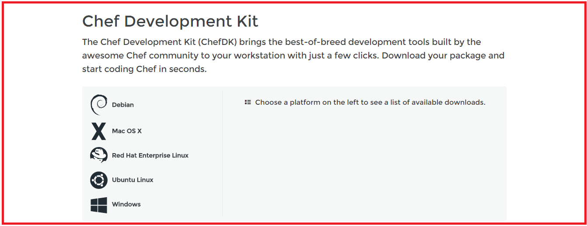
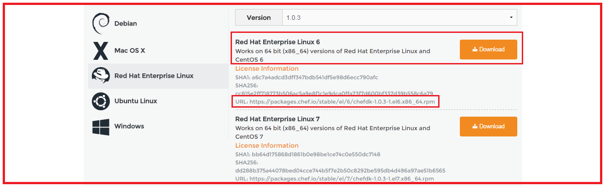
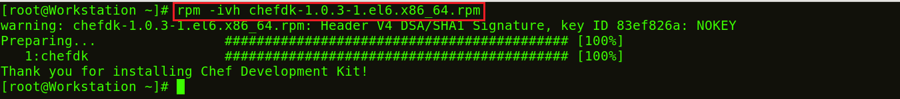

Os **_Nodes_** usam o Chef-Client para solicitar ao Chef Server detalhes de configuração, como  _**Recipes**_, modelos e distribuições de arquivos. O Chef-Client então faz o máximo de trabalho de configuração possível nos próprios Nodes (e não no Chef Server). Cada Node tem um software Chef Client instalado, que irá puxar para baixo a configuração do Chef Server central aplicável a esse Node. Essa abordagem escalável distribui o esforço de configuração por toda a organização.

**Tutorial do Chef – **_Nodes_** do Chef**

Os **_Nodes_** podem ser um Server virtual baseado em nuvem ou um Server físico em seu próprio centro de dados, que é gerenciado usando o Chef Server central. O principal componente que precisa estar presente no Node é um agente que estabelecerá comunicação com o Chef Server central. Isso é chamado Chef Cliente.

Chef Client executa as seguintes funções:

* É responsável por interagir com o Chef Server central.
* Gerencia o cadastro inicial do Node no Chef Server central.
* Ele baixa Cookbooks e os aplica no Node para configurá-lo.
* Pesquisa periódica do Chef Server central para buscar novos itens de configuração, se houver.

_**[Clique aqui para saber como instalar Chef Server, Workstation e Node](00-install.md/)**_

**Tutorial do Chef – Vantagens do Chef:**

Este tutorial do Chef estará incompleto se eu não incluir os principais benefícios do Chef:

* Você pode automatizar toda uma infraestrutura usando o Chef. Todas as tarefas que eram feitas manualmente, agora podem ser feitas via ferramenta Chef.
* Você pode configurar milhares de **_Nodes_** em minutos usando o Chef.
* A automação do Chef funciona com a maioria das ofertas de nuvem pública como [**_AWS_**](https://www.edureka.co/blog/amazon-aws-tutorial/).
* O Chef não apenas automatizará as coisas, mas também manterá os sistemas sob verificação consistente e confirmará se o sistema está de fato configurado da maneira necessária (o agente/cliente do chef faz esse trabalho). Se alguém cometer um erro ao modificar um arquivo, o Chef o corrigirá.
* Uma infraestrutura inteira pode ser registrada na forma de um repositório Chef, que pode ser usado como um projeto para recriar a infraestrutura do zero.

Espero que tenham gostado deste tutorial do Chef até agora, chega de posts teóricos! vamos nos divertir com as mãos na massa.

**Tutorial do Chef - Hands-On**

Aqui vou explicar como criar uma receita, um livro de receitas e um modelo no Chef Workstation. Também explicarei como implantar um Cookbook da estação de trabalho para o Chef-Client (Chef Node).

Estou usando duas imagens virtuais, uma para o Chef Workstation e outra para o Chef Node. Para o Chef Server, usarei a versão hospedada do Chef (na nuvem). Você também pode usar uma máquina física para o Chef Server.

**Passo 1**: Instale o Chef DK (Kit de Desenvolvimento) na estação de trabalho do Chef.

O Chef DK é um pacote que contém todas as ferramentas de desenvolvimento necessárias para codificar o Chef. Aqui está o link para baixar o .

Aqui, escolha o sistema operacional que você está usando. Estou usando o CentOS 6.8. Então, clicarei em Red Hat Enterprise Linux.

Copie o link de acordo com a versão do CentOS que você está usando. Estou usando o CentOS 6, como você pode ver que destaquei na captura de tela acima.

Vá para o terminal da estação de trabalho e baixe o Chef DK usando o comando wget e cole o link.

**Execute isto:**

>`wget https://``packages.chef.io/stable/el/6/chefdk-1.0.3-1.el6.x86_64.rpm`

O pacote agora está baixado. É hora de instalar este pacote usando rpm.

**Execute isto:**

>`rpm -ivh chefdk-1.0.3-1.el6.x86_64.rpm`

O Chef DK agora está instalado na minha Workstations.

_fonte_: _https://www.edureka.co/blog/chef-tutorial/_

[Passo 2](02-steps.md)