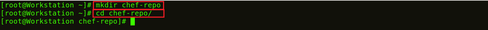
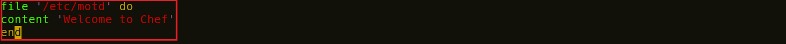
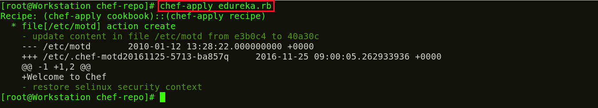

**Etapa 2:** Crie uma **_Recipe_** na Workstations

Vamos começar criando uma **_Recipe_** na Workstations e testá-la localmente para garantir que está funcionando. Crie uma pasta chamada chef-repo. Podemos criar nossas **_Recipe_**s dentro desta pasta.

**Execute isto:**

1

2

`mkdir chef``-``repo`

`cd chef``-``repo`

Neste diretório chef-repo, criarei uma **_Recipe_** chamada edureka.rb. .rb é a extensão usada para ruby. Eu usarei o editor vim, você pode usar qualquer outro editor que desejar, como gedit, emac, vi etc.

**Execute isto:**

1

`vim edureka.rb`

Aqui adicione o seguinte:

1

2

3

`file '/etc/motd'`

`conteúdo 'Bem-vindo ao Chef'`

`end`

Esta **_Recipe_** **e****dureka****.rb** cria um arquivo chamado /etc/motd com o conteúdo “Bem-vindo ao Chef”.

Agora vou usar esta **_Recipe_** para verificar se está funcionando.

**Execute** **isto:**

1

`chef``-``apply` `edureka.rb`

Portanto, há um arquivo criado no chef-repo com o conteúdo **Bem-vindo ao Chef.**

_fonte_: _https://www.edureka.co/blog/chef-tutorial/_

[Passo 3](03-steps.md)