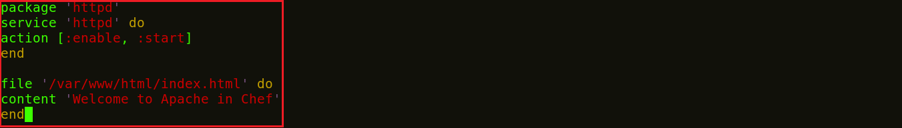
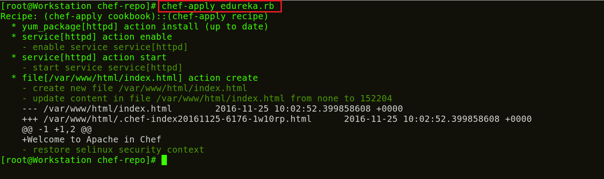
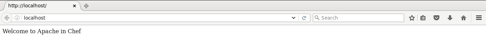

**Etapa 3:** Modificando o arquivo Recipe para instalar o pacote httpd

Vou modificar a **_Recipe_** para instalar o pacote httpd na minha Workstations e copiar um arquivo index.html para a raiz do documento padrão para confirmar a instalação. A ação padrão para um recurso de pacote é a instalação, portanto, não preciso especificar essa ação separadamente.

**Execute** **isto:**

>`vim edureka.rb`

Aqui adicione o seguinte:

>`package 'httpd'`

>`service 'httpd' do`

>`action [:enable, :start]`

>`end`

>`file '/var/www/html/index.html' do`

>`content 'Bem-vindo ao Apache no Chef'`

>`end`

Agora vou aplicar essas configurações executando o comando abaixo:

**Execute** **isto:**

>`chef-apply edureka.rb`

A execução do comando descreve claramente cada instância na **_Recipe_**. Ele instala o pacote Apache, habilita e inicia o serviço httpd na Workstations. E cria um arquivo index.html na raiz do documento padrão com o conteúdo “Bem-vindo ao Apache no Chef”.

Agora confirme a instalação do Apache2 abrindo seu navegador. Digite seu endereço IP público ou o nome do seu host. No meu caso, é localhost.

_fonte_: _https://www.edureka.co/blog/chef-tutorial/_

[Passo 4](04-steps.md)