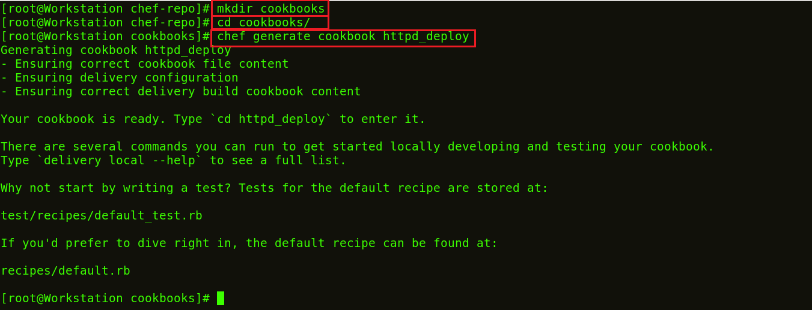
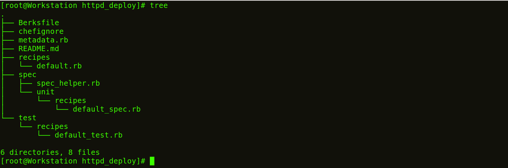

**Etapa 4:** Agora vamos criar nosso primeiro **_Cookbook_**.

Crie um diretório chamado cookbooks e execute o comando abaixo para gerar o Cookbook.

**Execute** **isto:**

>`mkdir cookbooks`

>`cd cookbooks  `

>`chef generate cookbook httpd_deploy`

httpd\_deploy é um nome dado ao Cookbook. Você pode dar o nome que quiser.

Vamos passar para este novo diretório httpd\_deploy.

**Execute** **isto:**

>`cd httpd_deploy`

Agora vamos ver a estrutura de arquivos do Cookbook criado.

**Execute** **isto:**

>`tree`

_fonte_: _https://www.edureka.co/blog/chef-tutorial/_

[Passo 5](05-steps.md)