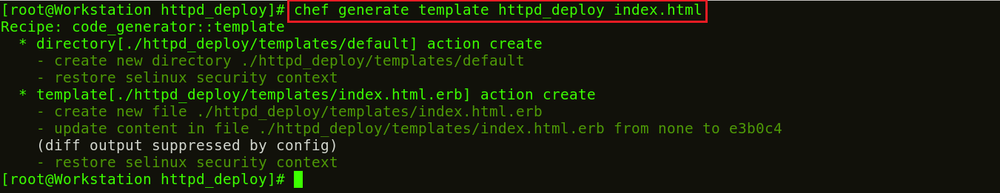
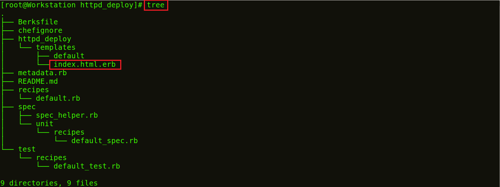

**Etapa 5:** Crie um arquivo de modelo.

Anteriormente, criei um arquivo com alguns conteúdos, mas que não cabem nas minhas  _**Recipes**_ e estruturas do **_Cookbook_**. Então, vamos ver como podemos criar um modelo para a página index.html.

**Execute** **isto:**

1

`chef generate template httpd_deploy index.html`

Agora, se você vir a estrutura do meu **_Cookbook_**, há uma pasta criada com os modelos de nome com o arquivo index.html.erb. Vou editar este arquivo de modelo index.html.erb e adicionar minha **_Recipe_** a ele. Consulte o exemplo abaixo:

Vá para o diretório padrão

**Execute** **isto:**

1

`cd /root/chef-repo/cookbook/httpd_deploy/templates/default`

Aqui, edite o modelo index.html.erb usando qualquer editor com o qual você se sinta confortável. Vou usar o editor vim.

**Execute** **isto:**

1

`vim index.html.erb`

Agora adicione o seguinte:

1

`Bem-vindo ao Chef Apache Deployment`

_fonte_: _https://www.edureka.co/blog/chef-tutorial/_

[Passo 6](06-steps.md)