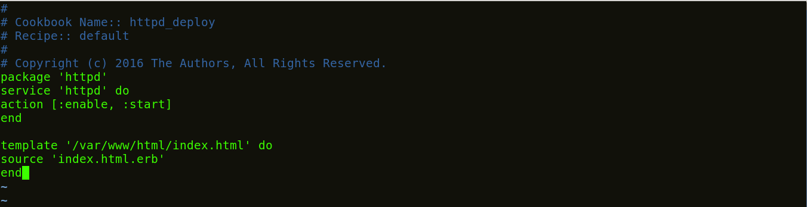
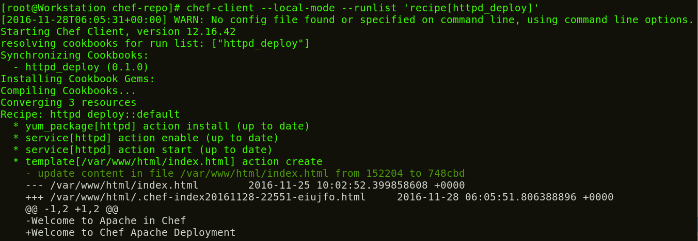

**Etapa 6:** Crie uma **_Recipe_** com este template.

Vá para o diretório **_Recipe_**s.

**Execute isto:**

1

`cd /root/chef-repo/cookbooks/httpd_deploy/recipes`

Agora edite o arquivo default.rb usando qualquer editor que desejar. Vou usar o editor vim.

**Execute** **isto:**

1

`vim default.rb`

Aqui adicione o seguinte:

1

2

3

4

5

6

7

`package 'httpd'`

`service 'httpd' do`

`action [:enable, :start]`

`end`

`template '/var/www/html/index.html' do`

`source 'index.html.erb'`

`end`

Agora vou voltar para minha pasta chef-repo e executar/testar minha **_Recipe_** na minha Workstations.

**Execute** **isto:**

1

2

`cd /root/chef-repo`

`chef-client` `--local-mode` `--runlist` `'**_recipe_**[httpd_deploy]'`

De acordo com minha **_Recipe_**, o Apache está instalado na minha Workstations, o serviço está sendo iniciado e ativado na inicialização. Além disso, um arquivo de modelo foi criado  na minha raiz de documento padrão.

Agora que testei minha Workstations. É hora de configurar o Chef Server.

_fonte_: _https://www.edureka.co/blog/chef-tutorial/_

[Passo 7](07-steps.md)