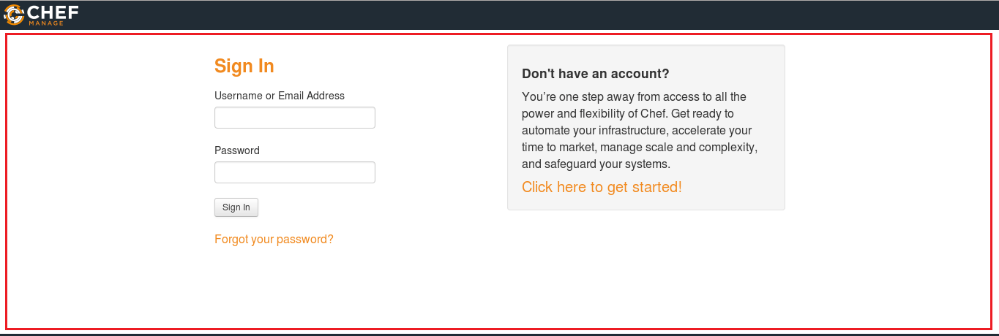
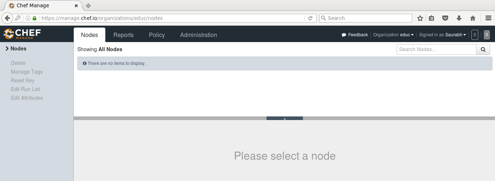
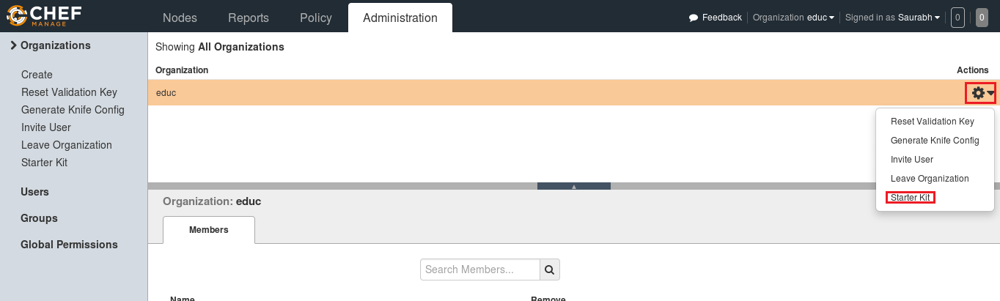
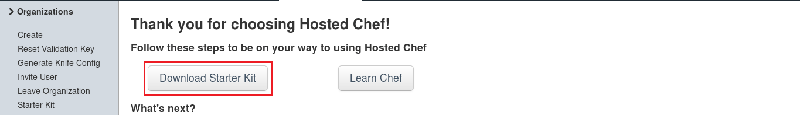
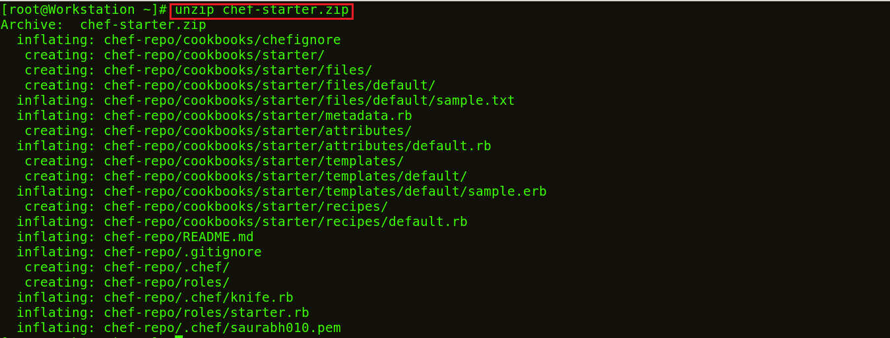
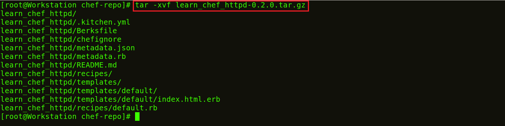
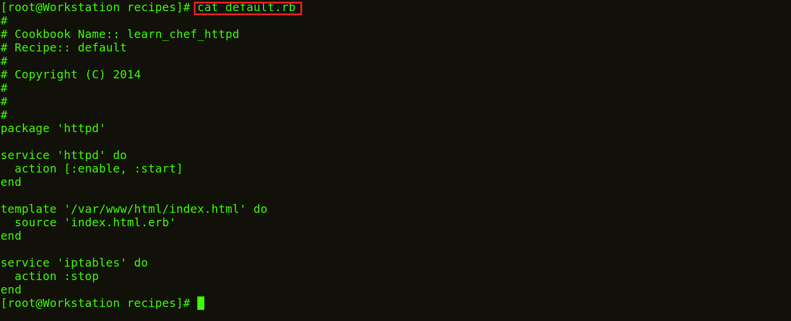

**Etapa 7:** Configurar o Chef Server

Usarei a versão hospedada do Chef Server na nuvem, mas você também pode usar uma máquina física. Este Chef-Server está presente em _[**manage.chef.io**](http://manage.chef.io)_

Aqui, crie uma conta se você não tiver uma. Depois de criar uma conta, faça login com suas credenciais de login.

É assim que o Chef Server se parece.

Se você estiver entrando pela primeira vez, a primeira coisa que fará será criar uma organização. A organização é basicamente um grupo de máquinas que você gerenciará com o Chef Server.

Primeiro, irei para a guia de administração. Lá, já criei uma organização chamada edu. Portanto, preciso baixar o kit inicial na minha Workstations. Este kit inicial ajudará você a enviar arquivos da Workstations para o Chef Server. Clique no ícone de configurações no lado direito e clique em Starter Kit.

Ao clicar ali, você terá a opção de baixar o Starter Kit. Basta clicar nele para baixar o arquivo zip do Starter Kit.

Mova este arquivo para seu diretório raiz. Agora descompacte este arquivo zip usando o comando unzip em seu terminal. Você notará que ele inclui um diretório chamado chef-repo.

**Execute** **isto:**

>`unzip chef-starter.zip`

Agora mova este kit inicial para o diretório do **_Cookbook_** no diretório chef-repo.

**Execute** **isto:**

>`mv starter /root/chef-repo/cookbook`

Os **_Cookbooks_** do Chef estão disponíveis no Cookbook Super Market, podemos ir ao Chef SuperMarket. Baixe os **_Cookbooks_** necessários em _[**supermarket.chef.io**](http://supermarket.chef.io)_. Estou baixando um dos **_Cookbooks_** para instalar o Apache de lá.

**Execute** **isto:**

>`cd chef-repo`

>`knife cookbook site download learn_chef_httpd`

Existe Tar ball baixado para o Apache Cookbook. Agora, precisamos extrair o conteúdo deste arquivo Tar baixado. Para isso, usarei o comando tar.

>`tar -xvf learn_chef_httpd-0.2.0.tar.gz`

Todos os arquivos necessários são criados automaticamente neste **_Cookbook_**. Não há necessidade de fazer nenhuma modificação. Vamos verificar a descrição da **_Recipe_** dentro da minha pasta de  _**Recipes**_.

**Execute** **isto:**

>`cd /root/chef-repo/learn_chef_httpd/recipes`

>`cat default.rb`

Agora, vou apenas carregar este **_Cookbook_** para o meu Chef Server, pois parece perfeito para mim.

_fonte_: _https://www.edureka.co/blog/chef-tutorial/_

[Passo 8](08-steps.md)