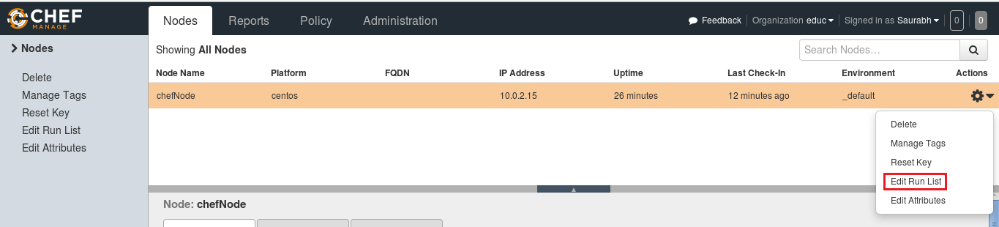
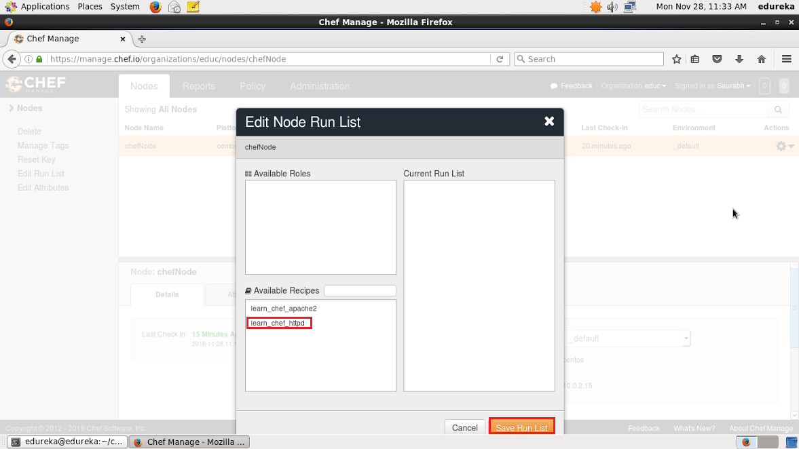
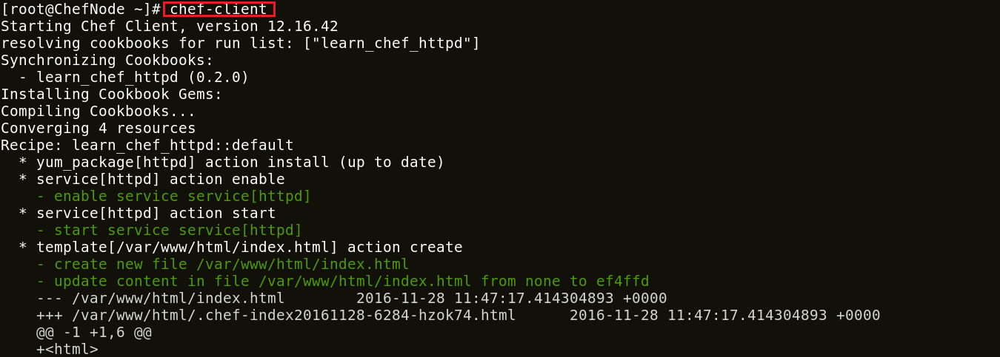

**Etapa 10:** Gerenciar lista de execução de **_Nodes_**

Vamos ver como podemos adicionar um Cookbook ao Node e gerenciar sua lista de execução no Chef Server. Como você pode ver na captura de tela abaixo, clique na guia Actions e selecione a opção Edit Run list para gerenciar a lista Run.

Nas  _**Recipes**_ Disponíveis,  você pode ver nossa **_Recipe_** learn\_chef\_httpd, você pode arrastá-la dos pacotes disponíveis para a Lista de Execuções atual e salvar a lista de Execuções.

Agora faça o login no seu Node e apenas execute o chef-client para executar a lista de execução.

** Executar **** t **** é: **

1

`chef-client`

Espero que você tenha gostado deste tutorial do Chef e aprendido como o Chef pode ser usado para configurar centenas de **_Nodes_**. O Chef está desempenhando um papel vital em muitas organizações para alcançar o DevOps. Com o Chef, as organizações estão lançando aplicativos com mais frequência e confiabilidade.

_fonte_: _https://www.edureka.co/blog/chef-tutorial/_