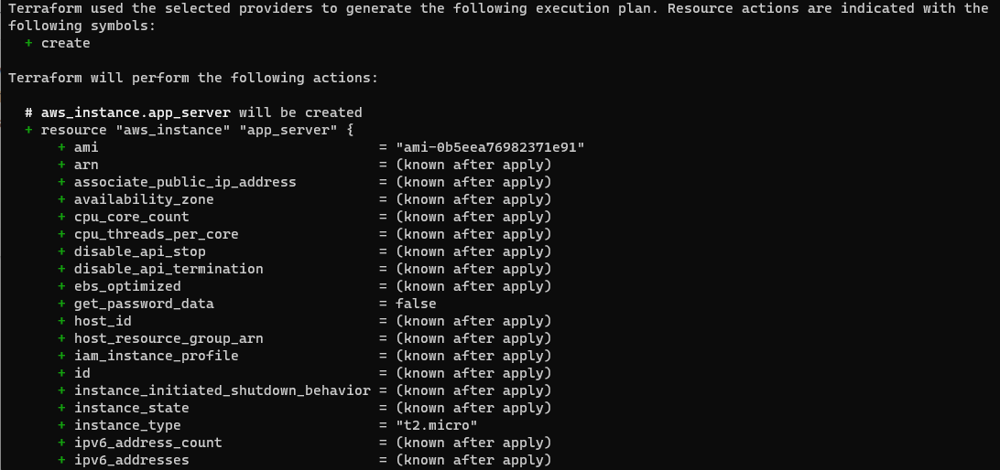
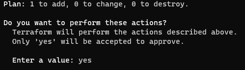
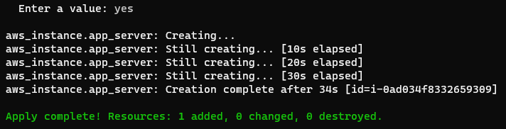

Criando uma instância EC2 (AWS)
==========================================================================================================================================


Pré-requisitos
-------------------------------

* O [Terraform CLI](https://developer.hashicorp.com/terraform/tutorials/aws-get-started/install-cli) (1.2.0+) instalado.
* A [AWS CLI](https://docs.aws.amazon.com/cli/latest/userguide/install-cliv2.html) instalada.
* [conta da AWS](https://aws.amazon.com/free) e [credenciais associadas](https://docs.aws.amazon.com/general/latest/gr/aws-sec-cred-types. html) que permitem criar recursos.

Para usar suas credenciais IAM para autenticar o provedor Terraform AWS, defina a variável de ambiente `AWS_ACCESS_KEY_ID`.

     $ export AWS_ACCESS_KEY_ID=

Agora defina a variável de ambiente `AWS_SECRET_ACCESS_KEY`.

     $ export AWS_SECRET_ACCESS_KEY=

>**Dica:** Se você não tiver acesso às credenciais de usuário do IAM, use outro método de autenticação descrito na [documentação do provedor da AWS](https://registry.terraform.io/providers/hashicorp/aws/latest/docs).


Gravar configuração
-------------------------------------------

O conjunto de arquivos usados para descrever a infraestrutura no Terraform é conhecido como Terraform _configuration_. Você escreverá sua primeira configuração para definir uma única instância do AWS EC2.

Cada configuração do Terraform deve estar em seu próprio diretório de trabalho. Crie um diretório para sua configuração.

     $ mkdir aprender-terraform-aws-instance
    
Copie Change no diretório.

     $cd aprender-terraform-aws-instance
    
Copiar Crie um arquivo para definir sua infraestrutura.

     $ toque em main.tf

Abra main.tf em seu editor de texto, cole a configuração abaixo e salve o arquivo.

>**Dica:** O ID da AMI usado nesta configuração é específico para a região `us-east-1`. Se você quiser usar uma região diferente, consulte a [seção de solução de problemas](https://developer.hashicorp.com/terraform/tutorials/aws-get-started/aws-build#troubleshooting) para obter orientação.

```terraform

terraform {
  required_providers {
    aws = {
      source  = "hashicorp/aws"
      version = "~> 4.16"
    }
  }

  required_version = ">= 1.2.0"
}

provider "aws" {
  region = "us-east-1"
}

resource "aws_instance" "app_server" {
  ami                    = "ami-0b5eea76982371e91"
  instance_type          = "t2.micro"

  tags = {
    Name = "ExampleAppServerInstance"
  }
}

```

Esta é uma configuração completa que você pode implantar com o Terraform. As seções a seguir revisam cada bloco dessa configuração com mais detalhes.

Terraform Block
--------------------

O bloco `terraform {}` contém as configurações do Terraform, incluindo os provedores necessários que o Terraform usará para provisionar sua infraestrutura. Para cada provedor, o atributo `source` define um nome de host opcional, um namespace e o tipo de provedor. O Terraform instala provedores do [Terraform Registry](https://registry.terraform.io/) por padrão. Nesta configuração de exemplo, a fonte do provedor `aws` é definida como `hashicorp/aws`, que é uma abreviação de `registry.terraform.io/hashicorp/aws`.

Você também pode definir uma restrição de versão para cada provedor definido no bloco `required_providers`. O atributo `version` é opcional, mas recomendamos usá-lo para restringir a versão do provedor para que o Terraform não instale uma versão do provedor que não funcione com sua configuração. Se você não especificar uma versão do provedor, o Terraform baixará automaticamente a versão mais recente durante a inicialização.

Para saber mais, consulte a [documentação de origem do provedor](https://developer.hashicorp.com/terraform/language/providers/requirements).

Providers
-----------

O bloco `provider` configura o provedor especificado, neste caso `aws`. Um provedor é um plug-in que o Terraform usa para criar e gerenciar seus recursos.

Você pode usar vários blocos de provedor em sua configuração do Terraform para gerenciar recursos de diferentes provedores. Você pode até usar diferentes provedores juntos. Por exemplo, você pode passar o endereço IP de sua instância do AWS EC2 para um recurso de monitoramento do DataDog.

Resources
------------

Use blocos `resource` para definir os componentes de sua infraestrutura. Um recurso pode ser um componente físico ou virtual, como uma instância do EC2, ou pode ser um recurso lógico, como um aplicativo Heroku.

Os blocos de recursos têm duas strings antes do bloco: o tipo de recurso e o nome do recurso. Neste exemplo, o tipo de recurso é `aws_instance` e o nome é `app_server`. O prefixo do tipo é mapeado para o nome do provedor. Na configuração de exemplo, o Terraform gerencia o recurso `aws_instance` com o provedor `aws`. Juntos, o tipo e o nome do recurso formam um ID exclusivo para o recurso. Por exemplo, o ID da sua instância do EC2 é `aws_instance.app_server`.

Os blocos de recursos contêm argumentos que você usa para configurar o recurso. Os argumentos podem incluir coisas como tamanhos de máquinas, nomes de imagens de disco ou IDs de VPC. Nossa [referência de provedores](https://developer.hashicorp.com/terraform/language/providers) lista os argumentos obrigatórios e opcionais para cada recurso. Para sua instância do EC2, a configuração de exemplo define o ID da AMI para uma imagem do Ubuntu e o tipo de instância para `t2.micro`, que se qualifica para o nível gratuito da AWS. Ele também define uma tag para dar um nome à instância.


Inicialize o Projeto
----------------------

Quando você cria uma nova configuração — ou verifica uma configuração existente no controle de versão — você precisa inicializar o diretório com `terraform init`.

A inicialização de um diretório de configuração baixa e instala os provedores definidos na configuração, que neste caso é o provedor `aws`.

    $ terraform init


O Terraform baixa o provedor `aws` e o instala em um subdiretório oculto do seu diretório de trabalho atual, denominado `.terraform`. O comando `terraform init` imprime qual versão do provedor foi instalada. O Terraform também cria um arquivo de bloqueio chamado `.terraform.lock.hcl` que especifica as versões exatas do provedor usadas, para que você possa controlar quando deseja atualizar os provedores usados para seu projeto.


Formatar e Validar a configuração
-----------------------------------

Recomendamos o uso de formatação consistente em todos os seus arquivos de configuração. O comando `terraform fmt` atualiza automaticamente as configurações no diretório atual para legibilidade e consistência.

Formate sua configuração. O Terraform imprimirá os nomes dos arquivos modificados, se houver. Nesse caso, seu arquivo de configuração já foi formatado corretamente, então o Terraform não retornará nenhum nome de arquivo.

    $terraform fmt

Você também pode certificar-se de que sua configuração seja sintaticamente válida e internamente consistente usando o comando `terraform validate`.

    $ terraform validate


Criar o recurso
-----------------------

Aplique a configuração agora com o comando _terraform apply_. O Terraform imprimirá uma saída semelhante à mostrada abaixo. Nós truncamos parte da saída para economizar espaço.

    $ terraform apply




>**Dica:** se sua configuração não for aplicável, você pode ter personalizado sua região ou removido sua VPC padrão. Consulte a seção [solução de problemas](https://developer.hashicorp.com/terraform/tutorials/aws-get-started/aws-build#troubleshooting) deste tutorial para obter ajuda.

Antes de aplicar qualquer alteração, o Terraform imprime o _plano de execução_ que descreve as ações que o Terraform executará para alterar sua infraestrutura para corresponder à configuração.

O formato de saída é semelhante ao formato diff gerado por ferramentas como o Git. A saída tem um `+` ao lado de `aws_instance.app_server`, o que significa que o Terraform criará esse recurso. Abaixo disso, mostra os atributos que serão definidos. Quando o valor exibido for `(conhecido após aplicar)`, significa que o valor não será conhecido até que o recurso seja criado. Por exemplo, a AWS atribui nomes de recursos da Amazon (ARNs) a instâncias na criação, portanto, o Terraform não pode saber o valor do atributo `arn` até que você aplique a alteração e o provedor da AWS retorne esse valor da API da AWS.

O Terraform agora fará uma pausa e aguardará sua aprovação antes de prosseguir. Se algo no plano parecer incorreto ou perigoso, é seguro abortar aqui antes que o Terraform modifique sua infraestrutura.

Neste caso, o plano é aceitável, então digite `yes` no prompt de confirmação para prosseguir. A execução do plano levará alguns minutos, pois o Terraform aguarda a disponibilização da instância do EC2.



Agora você criou uma infraestrutura usando o Terraform! Visite o [console do EC2](https://us-east-1.console.aws.amazon.com/ec2/home?region=us-east-1#Instances:) e encontre sua nova instância do EC2.



>**Observação:** de acordo com o bloco do provedor `aws`, sua instância foi criada na região `us-east-1`. Certifique-se de que seu Console AWS esteja definido para esta região.

_fonte_ : _https://developer.hashicorp.com/terraform/tutorials_