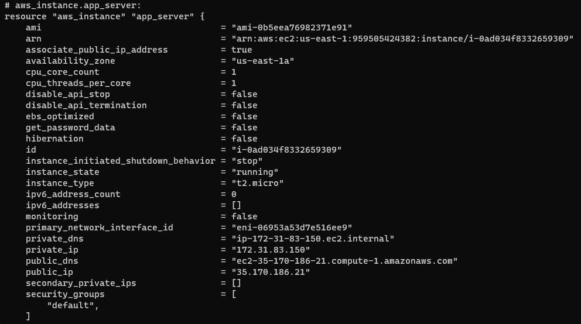
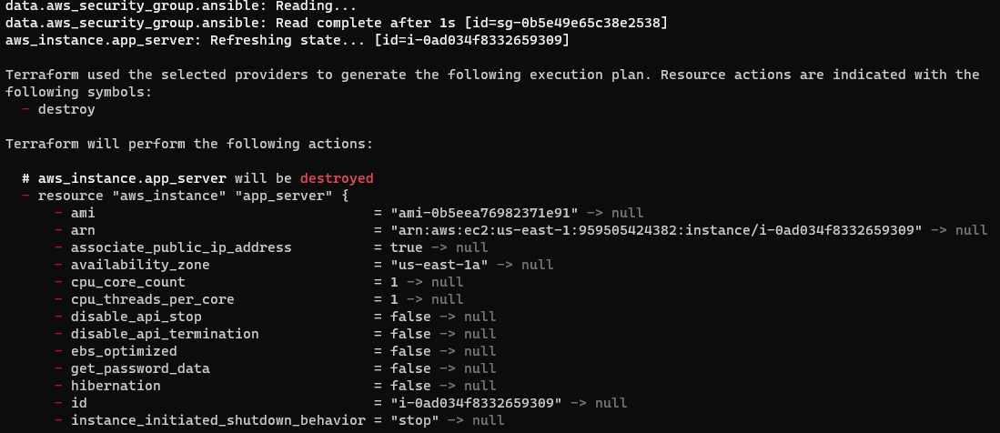
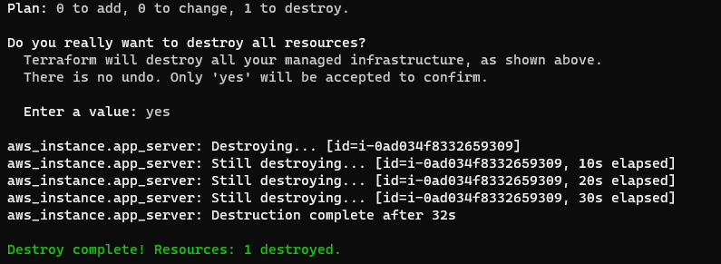

Destruindo uma instancia EC2 (AWS) com a utilização do Estado da aplicação
==========================================================================================================================================

Checando o Estado
--------------------

Quando você aplicou sua configuração, o Terraform gravou os dados em um arquivo chamado `terraform.tfstate`. O Terraform armazena os IDs e as propriedades dos recursos que gerencia neste arquivo, para que possa atualizar ou destruir esses recursos no futuro.

O arquivo de estado do Terraform é a única maneira pela qual o Terraform pode rastrear quais recursos ele gerencia e geralmente contém informações confidenciais, portanto, você deve armazenar seu arquivo de estado com segurança e restringir o acesso apenas a membros confiáveis da equipe que precisam gerenciar sua infraestrutura. Em produção, recomendamos [armazenar seu estado remotamente](https://developer.hashicorp.com/terraform/tutorials/cloud/cloud-migrate) com Terraform Cloud ou Terraform Enterprise. O Terraform também suporta vários outros [backends remotos](https://developer.hashicorp.com/terraform/language/settings/backends/configuration) que você pode usar para armazenar e gerenciar seu estado.

Inspecione o estado atual usando `terraform show`.

    $ terraform show

Quando o Terraform criou essa instância do EC2, ele também reuniu os metadados do recurso do provedor da AWS e gravou os metadados no arquivo de estado. Em tutoriais posteriores, você modificará sua configuração para fazer referência a esses valores para configurar outros recursos e valores de saída.

Agora você criou e atualizou uma instância do EC2 na AWS com o Terraform. Neste tutorial, você usará o Terraform para destruir essa infraestrutura.

Uma vez que você não precisa mais de infraestrutura, você pode querer destruí-la para reduzir sua exposição e custos de segurança. Por exemplo, você pode remover um ambiente de produção do serviço ou gerenciar ambientes de curta duração, como construir ou testar sistemas. Além de construir e modificar a infraestrutura, o Terraform pode destruir ou recriar a infraestrutura que gerencia.

Destroy
--------

O comando `terraform destroy` finaliza os recursos gerenciados pelo seu projeto Terraform. Este comando é o inverso de `terraform apply`, pois encerra todos os recursos especificados em seu estado Terraform. Ele _não_ destrói recursos em execução em outro lugar que não sejam gerenciados pelo projeto atual do Terraform.

Destrua os recursos que você criou.

    $ terraform destroy

O prefixo `-` indica que a instância será destruída. Assim como o apply, o Terraform mostra seu plano de execução e aguarda a aprovação antes de fazer qualquer alteração.

Respondendo `yes` você dispara os comandos do terraform para eliminar todos os recursos listados

Assim como com `apply`, o Terraform determina a ordem para destruir seus recursos. Nesse caso, o Terraform identificou uma única instância sem outras dependências e, portanto, destruiu a instância. Em casos mais complicados com vários recursos, o Terraform os destruirá em uma ordem adequada para respeitar as dependências.

_fonte_ : _https://developer.hashicorp.com/terraform/tutorials_