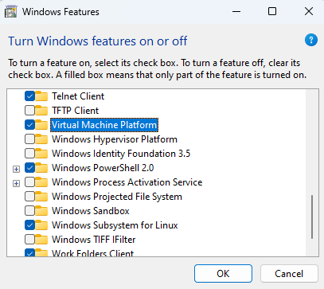

Introdução
============

**O WSL permite que você use as ferramentas que desejar, no ambiente que desejar, no hardware que desejar.**

Seja você um desenvolvedor experiente ou apenas começando, uma das decisões mais importantes que você precisa tomar é o tipo de hardware e ambiente de desenvolvimento a ser usado. No passado, a maioria dos profissionais de desenvolvimento diria para você ficar com macOS ou Linux porque as ferramentas, linguagens e estruturas de desenvolvimento mais comuns eram fáceis de instalar e trabalhar. Tudo isso mudou com o Windows Subsystem for Linux (WSL). O WSL permite executar um ambiente GNU/Linux - incluindo a maioria das ferramentas de linha de comando, utilitários e aplicativos - diretamente no Windows, sem modificações e totalmente integrado ao sistema de arquivos do Windows e às ferramentas favoritas, como o Visual Studio Code.

Quer trabalhar com Node.js? Ruby on Rails? Django e Python? Com o WSL, você pode instalar sua distribuição Linux preferida (como o Ubuntu) e, ao abri-la pela primeira vez, será saudado por um rosto familiar: o shell Bash. A partir daí, você pode tratá-lo como uma distribuição regular do Linux: instale binários usando o gerenciador de pacotes, edite arquivos em editores integrados como Vim ou Emacs e inicie processos como verdadeiros binários do Linux.

Melhor ainda, agora você pode acessar diretamente arquivos e ferramentas do Windows a partir do shell Bash e alternar perfeitamente entre o ambiente Linux e o Windows. Você não precisa escolher entre Bash e PowerShell. Você pode usar os dois.

Se você é novo no desenvolvimento de software, um desenvolvedor experiente do Windows interessado em aprender mais sobre como usar o Linux, um amante do Linux que gostaria de integrar o Windows ou se você está executando os dois sistemas separadamente e está pronto para integrar eles, este curso é para você! _Pronto para saber mais?_

Observação

O WSL não foi projetado para executar uma interface gráfica do usuário. Ao usar o WSL, você trabalhará exclusivamente com a linha de comando.

Objetivos de aprendizado
-------------------

Neste módulo, você irá:

* Habilite o Windows Subsystem for Linux e instale uma distribuição Linux.
* Integre seu fluxo de trabalho entre comandos nativos do Linux e do Windows, sistemas de arquivos e ferramentas.
* Crie um aplicativo da web Hello World usando Node.js e Express.
* Integre sua distribuição Linux com o Visual Studio Code e personalize seu terminal.
* Depure seu site Node.js com Visual Studio Code e ferramentas Linux.
* Execute várias distribuições do Linux, alterne entre elas e defina um padrão.

* * *


Habilite o Subsistema do Windows para Linux e instale uma distribuição
=================================================================

Para habilitar o Windows Subsystem for Linux (WSL) em seu computador, você precisa:

1. Abra o PowerShell como administrador. No menu **Iniciar**, digite **PowerShell** para abrir o aplicativo de desktop. Clique com o botão direito do mouse em **Windows PowerShell** e selecione **Executar como administrador**.
    
2. Depois que a janela de comando **Administrador: Windows PowerShell** for aberta, copie e cole este script para habilitar o recurso WSL:
    
    
         Enable-WindowsOptionalFeature -Online -FeatureName Microsoft-Windows-Subsystem-Linux
        
    
     Observação
    
     Outra alternativa é utilizar o painel de controle: `Control Panel > All Control Panel Items > Programs and Features > Turn Windows Features on off`

     

     Verifique se estas opções estão habilitadas, caso não estejam, habilite-as:

     * **Virtual Machine Platform**
     * **Windows Subsystem for linux**

     
     

    
3. Reinicie o computador quando solicitado.
    

Instalar uma distribuição Linux
-----------------------

Existem várias distribuições Linux disponíveis para execução no WSL. Você pode encontrar e instalar o seu favorito na Microsoft Store.

Em geral, você deseja escolher uma distribuição que ofereça os pacotes de software de que você precisa, se alinhe com o ambiente de produção que você deseja e use ferramentas e comandos com os quais você esteja familiarizado. Por exemplo, o Ubuntu usa o comando `apt` para instalar software, enquanto o SUSE usa `zypper` e o Fedora usa `dnf`. Todos esses gerenciadores de pacotes executam as mesmas tarefas básicas de maneiras ligeiramente diferentes e oferecem pacotes ligeiramente diferentes para instalação.

_Recomendamos a instalação do [Ubuntu](https://www.microsoft.com/store/p/ubuntu/9nblggh4msv6) para este curso._

1. Abra a Microsoft Store. (Você pode encontrá-lo no menu **Iniciar**.) Digite **Linux** na caixa **Pesquisar**. Você verá uma lista de distribuições do Linux na seção **Aplicativos**.
    
     Os links a seguir abrirão a página da Microsoft Store para cada uma dessas distribuições do Linux com suporte:
    
     * [Ubuntu](https://www.microsoft.com/store/p/ubuntu/9nblggh4msv6)
     * [openSUSE](https://www.microsoft.com/store/apps/9njvjts82tjx)
     * [SLES](https://www.microsoft.com/store/apps/9p32mwbh6cns)
     * [Kali Linux](https://www.microsoft.com/store/apps/9PKR34TNCV07)
     * [Debian GNU/Linux](https://www.microsoft.com/store/apps/9MSVKQC78PK6)
2. Na página da distribuição, selecione **Obter**. _(Ubuntu é um download razoavelmente grande, mais de 200 MB, e pode levar algum tempo para instalar.)_
    

Para métodos alternativos de instalação ou solução de problemas, consulte o [Guia de instalação do Windows Subsystem for Linux para Windows 10](https://learn.microsoft.com/en-us/windows/wsl/install-win10).


3. Após a instalação da distribuição do Linux, abra-a. Se você perder o prompt após a instalação, digite o nome da sua distro no menu **Iniciar** - por exemplo _ubuntu_. Você será solicitado a criar um nome de conta e senha quando executar uma distribuição pela primeira vez. Após essa primeira vez, ao iniciar a distribuição, você será conectado como esse usuário normal (não administrador) por padrão.
    
     Observação
    
     Você pode escolher qualquer nome de usuário e senha. Eles não têm relação com seu nome de usuário do Windows. Depois de criar a conta de usuário, sua senha não será solicitada ao usar a distribuição, a menos que você eleve um processo usando o comando `sudo`. Sudo significa "SuperUser Do" e é usado para qualquer tarefa que exija privilégio de administrador root, como instalar ferramentas ou estruturas.
    

Atualize sua distribuição
------------------------

Recomendamos atualizar sua distribuição Linux regularmente. A maioria das distribuições do Linux vem com um catálogo de pacotes vazio ou mínimo. Uma atualização garantirá que ele tenha os pacotes mais recentes. O Windows não atualiza ou atualiza automaticamente suas distribuições do Linux. Os usuários do Linux geralmente preferem controlar essa tarefa sozinhos.

Para atualizar sua distribuição Ubuntu, use o gerenciador de pacotes APT colando este comando no terminal: `sudo apt update && sudo apt upgrade`. (Esses comandos serão explicados mais adiante na Unidade 4.)

Para ativar `sudo apt install <nome do pacote>`, execute este comando: `sudo apt-get update`.

Crie uma distribuição Linux personalizada
----------------------------------

Você também pode criar sua própria distribuição personalizada do Linux para envio à Microsoft Store e/ou sideload. No final deste curso, você encontrará um link para instruções, uma amostra de distribuição personalizada do WSL de código aberto e o repositório do iniciador de distribuição.

Observação

**Curioso para saber como o WSL funciona?** Você deve estar se perguntando como o Linux pode ser executado nativamente no Windows 10 sem uma VM ou um shell do Docker. Nos bastidores, você está executando o Linux no modo de usuário, mas sem o kernel do Linux. As syscalls (chamadas de sistema) que as distribuições Linux não modificadas usam são intermediadas para o Windows. É chamado de "processo PICO", uma versão menor de um processo host normal que é executado usando um driver de modo kernel no Windows. As dependências do sistema operacional são essencialmente desacopladas do sistema operacional do host subjacente, mantendo tudo leve e evitando o custo indireto de recursos. Você pode ver o processo em execução no Windows Task Manager.


Tente você mesmo
---------------

Na próxima seção, veremos como alternar entre os sistemas de arquivos Windows e Linux, executar alguns comandos básicos do Linux, alternar entre as distribuições do Linux e discutir algumas dicas e truques gerais para usar o WSL.

* * *

Integração entre sistemas de arquivos Windows e Linux
====================================================

Agora que você habilitou o WSL e instalou uma distribuição do Linux, tentaremos alguns comandos básicos do Linux, experimentaremos a movimentação entre os sistemas de arquivos Windows e Linux e usaremos algumas das ferramentas integradas.

Experimente alguns comandos básicos do Linux
-------------------------

Abra a linha de comando do Ubuntu. _Isso às vezes é chamado de bash shell, terminal, console, interface de linha de comando (CLI) ou, mais frequentemente no Windows, prompt de comando. Esses termos são comumente usados de forma intercambiável._


Vamos tentar alguns comandos básicos do Linux.

1. Verifique em qual diretório você está digitando `pwd` (imprimir diretório de trabalho).
    
     Este comando nos dá o caminho absoluto, ou seja, o caminho que começa na raiz. A raiz é a base do sistema de arquivos Linux. É indicado por uma barra ( / ). O diretório do usuário geralmente é algo como `/home/username`.
    
2. Digite `ls` para ver quais arquivos estão no diretório do seu caminho atual. Você pode ver os arquivos ocultos usando o comando `ls -a`.
    
     A exibição dos arquivos ocultos revelará o arquivo `.bash_history`, que armazena uma lista de comandos que você usou recentemente. (Execute o comando: `history` para visualizar esta lista.) Você também pode usar o arquivo oculto `.bash_logout` para limpar as tarefas ao sair. Por fim, você pode usar os arquivos `.bashrc` e `.profile` para personalizar como sua linha de comando aparece, declarar variáveis, criar aliases ou atalhos e muito mais.
    
3. Vá para um diretório adequado para nossos experimentos. Se você estiver usando o Ubuntu, uma boa maneira de mover para um local adequado seria `cd /home/user`, onde `user` é o nome que você escolheu quando instalou o WSL pela primeira vez.
    
4. Crie um diretório chamado `LearnWSL` digitando `mkdir LearnWSL`. Vá para esse diretório digitando `cd LearnWSL`.
    
5. Crie um arquivo chamado `wsl-rocks.html` digitando `touch wsl-rocks.html`. Para ver se você criou o arquivo com sucesso, digite `ls`.
    
6. Abra o arquivo `wsl-rocks.html` usando um dos editores de texto embutidos, como Nano ou Vim. O Vim pode ser difícil para iniciantes, então vamos usar o Nano. Abra seu arquivo `wsl-rocks.html` com o Nano usando `nano wsl-rocks.html`. O editor de texto Nano será aberto na janela de comando e exibirá uma lista de comandos na parte inferior da tela.
    
     Dica
    
     Selecionar a tecla Tab depois de digitar alguns caracteres preencherá automaticamente um nome de arquivo ou caminho para você. Então, para editar o arquivo, você também pode inserir `nano w` e selecionar Tab para completar a linha.
    
     Dica
    
     Se você abrir o Vim acidentalmente, saia pressionando Ctrl+C e depois `:q`, ou `:wq` se quiser salvar e sair.
    
7. No Nano, insira algum HTML básico em seu arquivo `wsl-rocks.html`:
    
    ```html    
         <!DOCTYPE html>
         <html>
         <body style="background-color: tan; font-family: calibri; text-align: center">
         <h1 style="color: blue">Meu primeiro título</h1>
         <p>Meu primeiro parágrafo.</p>
         
         </body>
         </html>
        
    ```
     Dica
    
     Teclas de atalho típicas usadas para copiar e colar (Ctrl+C, Ctrl+V) não funcionarão em seu shell WSL Bash. Em vez disso, basta clicar com o botão direito do mouse para colar depois de copiar um trecho de código.
    
8. Pressione Ctrl+X para voltar à linha de comando. Salve o que você escreveu (Y, então pressione Enter), e então exiba o conteúdo do arquivo usando `cat wsl-rocks.html`.
    

Você encontrará um link para comandos mais básicos do Linux no final deste curso. Você também pode usar `man` para ver as páginas de manual de um comando (por exemplo, `man tar`), ou tentar executar um comando mais `--help` para ver como o comando pode ser usado (por exemplo, `nano --help`).

Execute alguns comandos do Linux usando o prompt de comando do Windows
-------------------------------------------------- ----------

A execução de uma distribuição do Linux no WSL mostra como os sistemas de arquivos se integram para uma experiência perfeita. Você pode chamar binários do Windows na linha de comando do Linux e binários do Linux no prompt de comando do Windows.

Vamos começar abrindo o prompt de comando do Windows (procure por **cmd** na pesquisa do Windows):


1. Digite `dir` para ver os arquivos no diretório do seu caminho atual. Note que se você tentar o equivalente Linux deste comando, `ls`, ele não funcionará.
    
2. Para usar o equivalente Linux do comando `dir` no prompt de comando do Windows, digite `wsl ls`. Você verá que esse comando do Linux agora funciona no prompt de comando do Windows porque você invocou o Linux.
    
3. Você também pode executar seu caminho de distribuição Linux diretamente no prompt de comando do Windows (ou no PowerShell), digitando `wsl.exe` ou `bash.exe`. Esses comandos mudarão para uma exibição da linha de comando do Linux, usando o caminho para seu diretório atual. Este caminho parecerá estar em uma pasta montada, `/mnt/c`, porque agora estamos visualizando a pasta da unidade C:\\ do Windows a partir do subsistema Linux. Você pode acessar todo o sistema de arquivos do seu computador local a partir do shell do Linux usando este caminho de arquivo montado `/mnt/c`.
    
4. Vamos adicionar outro diretório e arquivo ao diretório `LearnWSL` que criamos anteriormente na linha de comando do Ubuntu. Digite `wsl.exe` para abrir o shell Bash, caso ainda não o tenha feito. Como nosso caminho de arquivo agora está na unidade C:\\ `/mnt/c` do Windows, precisaremos determinar onde `LearnWSL` está localizado. Use `locate LearnWSL` para procurar o diretório. _(Ops! Observe que esta tentativa de localizar o diretório provavelmente falhará. Continue lendo!)_
    
5. O comando `locate LearnWSL` falhou por alguns motivos. Primeiro, o banco de dados de localização é executado apenas uma vez por dia e ainda não registrou o novo diretório. Você precisará executar `updatedb` para registrar suas alterações para que possa localizá-las.
    
     Em segundo lugar, o comando `locate` requer privilégio administrativo root, em outras palavras, o comando `sudo`.
    
     Portanto, para encontrar o diretório, você precisará inserir `sudo updatedb`, aguardar a conclusão do comando e, em seguida, inserir `sudo localizar LearnWSL`. Esses comandos devem retornar o caminho no qual você pode encontrar o diretório, provavelmente algo como `/home/user/LearnWSL` (onde `user` é o seu nome de usuário).
    
6. Crie um novo diretório com `mkdir /home/user/LearnWSL/temp` (substituindo `user` pelo seu nome de usuário).
    
7. Para sair do shell do Linux e voltar ao prompt de comando do Windows, digite `exit`. Abra sua linha de comando do Ubuntu agora e verifique se o diretório `temp` que você criou está lá.
    

Execute as ferramentas do Windows a partir do WSL e misture comandos
-------------------------------------------

Você também pode misturar comandos do Windows e do Linux. Vamos tentar.

1. Execute o aplicativo Bloco de Notas do Windows na linha de comando WSL aberta digitando `notepad.exe`. Aqui está outro útil: tente pegar sua configuração de IP do Windows com `ipconfig.exe`.
    
2. Você também pode executar o prompt de comando do Windows na linha de comando do Ubuntu. Basta digitar `cmd.exe`. Salte o caminho do diretório para C:\\ usando `cd ../..`, e então digite `dir | findstr Users` para filtrar os resultados da lista de diretórios para que exiba apenas o diretório `Users`. Saia do prompt de comando do Windows digitando `exit`.
    
3. Tente misturar comandos do Windows e do Linux usando o PowerShell. No PowerShell, digite `ipconfig.exe | grep IPv4` para usar o utilitário baseado em Linux Grep para filtrar os resultados da configuração de IP para que apenas o endereço IPv4 seja retornado. Você pode ver que a ferramenta `ipconfig.exe` baseada em Windows funciona bem em conjunto com o comando `grep` baseado em Linux.
    

Use o Python com o Ubuntu do PowerShell
--------------------------------------

A linguagem de programação Python está crescendo rapidamente em popularidade, especialmente para ciência de dados, IA e aprendizado de máquina, mas também para desenvolvimento da Web do lado do servidor com estruturas como Django e Flask. O Python vem pré-instalado com o Ubuntu. Vamos tentar.

1. Abra o PowerShell. Entre na linha de comando do Ubuntu usando `bash.exe`.
    
2. Verifique se o Python vem pré-instalado com o Ubuntu e para ver qual versão está sendo usada digitando `python3 --version`.
    
3. Tente executar um script Python simples. Digite `python3`. Este comando abrirá o shell Python dentro da linha de comando do Ubuntu, que por sua vez está dentro do PowerShell. (Começo!)
    
4. Digite `print("Hello World")`. Este é um script Python simples que responderá com "Hello World".
    
5. Vamos tentar um pouco de matemática com Python. Tente `x = 1` Enter, `y = 2` Enter e depois `x + y` Enter. O último comando deve retornar 3.
    
6. Saia do Python digitando `exit()`, ou pressionando Ctrl+D.
    
7. Por fim, vamos tentar o módulo de servidor local HTTP simples incluído no Python. Pudermos visualize o arquivo `wsl-rocks.html` que criamos anteriormente com este servidor local.
    
     Digite `cd /home/user/LearnWSL` (substituindo `user` pelo seu nome de usuário) para abrir o diretório `LearnWSL` que você criou anteriormente.
    
     Agora digite `python3 -m http.server` e abra um navegador da web.
    
     Acesse `http://localhost:8000/wsl-rocks.html` em seu navegador. Você poderá ver o código HTML que escreveu anteriormente em execução em um servidor local, na porta 8000. _Certifique-se de sair e interromper a execução do servidor pressionando Ctrl+C._
    
     Observação
    
     O Windows pode exibir um aviso de firewall na primeira vez que você iniciar o servidor web. Este aviso é esperado. Basta selecionar **Permitir acesso**.
    
     
    

* * *

_fonte_: _https://learn.microsoft.com/en-us/training/modules/get-started-with-windows-subsystem-for-linux/_